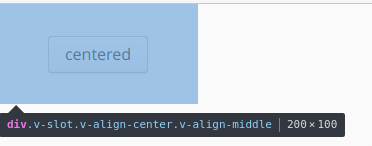
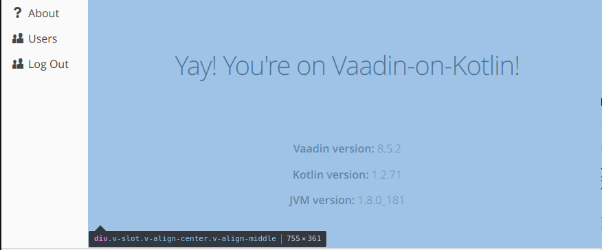

[Index](index.html) | [Getting Started](gettingstarted.html) | [Guides](vok-guides.html)

# Creating UIs

Vaadin-on-Kotlin uses the [Vaadin Framework](https://vaadin.com/docs/v8/framework/introduction/intro-overview.html) to deliver the UI.
Vaadin lets you forget the web and develop user interfaces much like you would develop a desktop application with conventional Java toolkits such as AWT, Swing, or SWT.
You add components such as Button and TextField into the page, nesting them in layouts which then position the components.

## Introduction

The web is composed of HTML pages. The basic building block of a HTML page is the *HTML element*, such as `<div>` or `<a>`.
Typical web frameworks require you to use HTML elements to build the pages. In this regard, Vaadin is different.

Instead of composing HTML elements, in Vaadin we compose *components*, such as `Button`, `ComboBox` and `VerticalLayout`.
Every Vaadin component consists of two parts:

* The client-side part of the component renders as one or more HTML elements and controls them by the means of JavaScript. For example a Google Map
  component would fetch individual tiles and produce a mesh of `<div>`s which then lay out the tiles to show the map itself.
* The server-side part of the component then exposes a high-level API. The Google Map component example would allow you to set zoom, to focus on particular
  GPS coordinates, to add markers etc.

This kind of approach makes it incredibly easy to add Google Maps to your site. You just use the components' server-side Java API and you don't
have to care about what the HTML will look like, or how exactly it will fetch the data. The code looks like follows:

```java
class MyView : VerticalLayout {
  init {
    setSizeFull()
    val maps = GoogleMaps()
    maps.setSizeFull()
    addComponent(maps)
  }
}
```

> *Info*: The client-side is typically written in Java and compiled to the JavaScript by the means of GWT.
It is however also possible to write components directly by using JavaScript. There are great resources on how to write
Vaadin client-side component, for example the [Client-side Development Guide](https://vaadin.com/docs/v8/framework/clientside/clientside-overview.html).
In this guide we will not focus on the client-side part; instead we will focus on how to compose the server-side components.

The components are typically rich in functionality. For example `ComboBox` does not render into the HTML `<input>` element but it instead renders
a rich `<div>` hierarchy which allows for features which are not possible with the `<input>` element, such as auto-completion.
There is a big palette of pre-made components, and we use server-side Java code to we compose and nest them. Vaadin
then makes sure to call the client-side of every component, to render the proper HTML elements. The rendering
process is typically self-contained, implemented in the component client-side code and typically can not be controlled directly from server-side Java.

For example, a typical Vaadin form uses the `FormLayout` component and adds a couple of `CheckBox`, `TextField` and
`ComboBox` components. The code on server-side would look like this:

```java
FormLayout layout = new FormLayout("New Employee Form");
TextField nameField = new TextField("Name:");
nameField.setValue("Donald Knuth");
layout.addComponent(nameField);
layout.addComponent(new CheckBox("Internal employee"));
layout.addComponent(new DatePicker("Date of birth:"));
```

This code builds a component *hierarchy* (a tree of components, in this case fields nested in a form layout). The components'
client-side code then renders itself as HTML elements.

With VoK, we create component hierarchies by employing the DSL Kotlin language feature. We will now show how that is done in VoK in a minute.

> **Note:** Vaadin 8 components are not to be
confused with the [Web Components Standard](https://en.wikipedia.org/wiki/Web_Components) which are used by Vaadin 10.
Vaadin 8's Components are in fact GWT widgets which are in essence just plain HTML elements controlled by JavaScript. GWT widgets
do not require the Web Component Standard to be supported
by the browser, however they also don't benefit from e.g. Shadow DOM isolation.
Vaadin 8 components can be thought of as a "predecessors" of the Web Component standard.

The following text doesn't expect you to be familiar with the Vaadin framework. However, it is best to have at least basic understanding of the Kotlin
programming language. If you feel lost in the following text, please take your time to learn of the Kotlin language features first.

## Available Components

Lots of components are already built-in. You can use e.g. [Vaadin Sampler](https://demo.vaadin.com/sampler/) to check out the built-in components;
you can also visit [Vaadin 8 Documentation on Components](https://vaadin.com/docs/v8/framework/components/components-overview.html) to read about all of the available
components.

You can find additional components at the [Vaadin Directory](https://vaadin.com/directory); just make sure to search for components intended for Vaadin 8 since
Vaadin 10 components won't work with Vaadin 8.

It is also possible to integrate a standalone GWT component into Vaadin; you can find out more at the [Integrating an existing GWT widget](https://vaadin.com/docs/v8/framework/articles/IntegratingAnExistingGWTWidget.html)
page.

## Creating Component Hierarchies

Please git-clone the [VoK Hello World App](https://github.com/mvysny/vok-helloworld-app) - we're going to experiment on that app. You can
do that by running this in your terminal:

```bash
git clone https://github.com/mvysny/vok-helloworld-app
```

If you open the [WelcomeView.kt](https://github.com/mvysny/vok-helloworld-app/blob/master/web/src/main/kotlin/com/example/vok/WelcomeView.kt)
file, you'll notice that it extends from the `VerticalLayout`. In Vaadin, `VerticalLayout` and `HorizontalLayout` are two most commonly
used layouts. By extending the `VerticalLayout` we state that the root layout of this view is going to be vertical.

Let's now replace the contents of the `WelcomeView` by a single button. Rewrite the `WelcomeView` class as follows:

```kotlin
@AutoView("")
class WelcomeView: VerticalLayout(), View {
    init {
        button("Click me") {
            onLeftClick {
                Notification.show("Clicked")
            }
        }
    }
}
```

The `button()` function simply creates the Vaadin `Button`, sets a caption into it, inserts it into the parent layout (in this case,
the root `VerticalLayout`/`WelcomeView`) and runs the configuration block for that button. The configuration block adds a left click
listener. When you ctrl+click the `button()` function, the definition of the function looks very cryptic:

```kotlin
fun (@VaadinDsl HasComponents).button(caption: String? = null, block: (@VaadinDsl Button).() -> Unit = {})
        = init(Button(caption), block)
```

This is a Kotlin function definition which allows us to build UIs in a structured way, by employing so-called DSLs. Don't worry if
this doesn't make any sense right now - we will explain this in a great detail later on.
What the function does is that it creates a button, adds it to the parent layout and allows the button to be configured further.

> *Info*: A technique called DSL (domain-specific language) is used to construct hierarchical structures using
just the Kotlin language features. Since the UI is a hierarchical structure with components nested inside layouts,
the DSL approach is applicable. In VoK we have constructed a set of functions which will allow you to construct Vaadin UIs
in a hierarchical manner. Please read the [Using DSL to write structured UI code](http://mavi.logdown.com/posts/7073786)
article on why a hierarchical code beats plain Java code.

Let us add a simple form, consisting of two text fields:

```kotlin
@AutoView("")
class WelcomeView: VerticalLayout(), View {
    init {
        formLayout {
            textField("Name:")
            textField("Age:")
        }
        button("Click me") {
            onLeftClick {
                Notification.show("Clicked")
            }
        }
    }
}
```

The `formLayout()` function creates Vaadin `FormLayout` component and adds it into the root `VerticalLayout`. Then it runs the configuration
block, acting as a parent layout in that block. This is very important since that will make the `textField()` function to correctly insert
the newly created `TextField` class into the `FormLayout` itself, and not into the root `VerticalLayout`.
This "magic" is actually just a feature of Kotlin. Kotlin simply passes current layout as a [receiver](https://kotlinlang.org/docs/reference/lambdas.html#function-literals-with-receiver)
to the `textField()` function. But more on that later.

> **Important**: the notation is that the DSL function for a component starts with a lower-case letter. For example,
the function which creates `FormLayout` is called `formLayout()`, the same goes for `label()`, `verticalLayout()` and all
other built-in Vaadin components. To add DSL function for add-ons and custom components, please read below.

## Layouts

Since the `VerticalLayout`, `HorizontalLayout` and `FormLayout` are the most used components, let's start with them. There is a great writeup
about the features at the Vaadin page: [VerticalLayout and HorizontalLayout](https://vaadin.com/docs/v8/framework/layout/layout-orderedlayout.html) -
please make sure to read that page first, before going further with this documentation. The most important bits are:

* The Layout positions "slots"; the children components are then positioned (aligned) inside of those slots.
* The Layout uses two different algorithms to position+size slots: the first one when the Layout's width is set to undefined (=wrap contents),
  the second one when the Layout's width is set to a concrete value (either absolute or percentage, =fill parent).

Now that you understand the concepts, let us list some examples. The first example is a classical example of doing
a perfect centering of a component inside of its parent. It was impossible to do with CSS prior
the flexbox, yet Vaadin's layouts use JavaScript to position children and thus follow their own logic. Centering of a child is thus a simple
case of setting the proper alignment to the child:

```kotlin
@AutoView("")
class WelcomeView: VerticalLayout(), View {
    init {
        setSizeFull()
        verticalLayout {
            w = 200.px; h = 100.px; isMargin = false
            button("centered") {
                alignment = Alignment.MIDDLE_CENTER
            }
        }
    }
}
```

The result is as follows:



Another case would be a button bar, having a bunch of buttons both on the left side and on the right side.
There is a `CSSLayout` acting as an spacer; since it's expanded it consumes all of the available space,
pushing follow-up buttons to the right:

```kotlin
@AutoView("")
class WelcomeView: VerticalLayout(), View {
    init {
        setSizeFull()
        horizontalLayout {
            w = 300.px; isSpacing = false
            button { icon = VaadinIcons.TRASH; styleName = ValoTheme.BUTTON_BORDERLESS }
            button { icon = VaadinIcons.ADD_DOCK; styleName = ValoTheme.BUTTON_BORDERLESS }
            cssLayout { isExpanded = true }
            button { icon = VaadinIcons.QUESTION; styleName = ValoTheme.BUTTON_BORDERLESS }
        }
    }
}
```


The same effect can be achieved even without the spacer component. In the following example, the "question" button
will act as the spacer; it will be positioned to the right in its slot to appear as right-centered:

```kotlin
setSizeFull()
horizontalLayout {
    w = 300.px; isSpacing = false
    button { icon = VaadinIcons.TRASH; styleName = ValoTheme.BUTTON_BORDERLESS }
    button { icon = VaadinIcons.ADD_DOCK; styleName = ValoTheme.BUTTON_BORDERLESS }
    button { isExpanded = true; icon = VaadinIcons.QUESTION; styleName = ValoTheme.BUTTON_BORDERLESS; alignment = Alignment.MIDDLE_RIGHT }
    button { icon = VaadinIcons.AIRPLANE; styleName = ValoTheme.BUTTON_BORDERLESS }
}
```

> *Info*: you can use the following [Vaadin Icons](https://pro.vaadin.com/icons) page to search for available Vaadin icons, or you can simply use IDE's
autocompletion feature for available `VaadinIcons` enum constants.

You can use the same approach for building the application frame. We're going to have the main menu to the right,
and expand the left area so that the views can be nested inside of it:

```kotlin
@PushStateNavigation
class MyUI : UI(), ViewDisplay {
    private lateinit var viewContainer: CssLayout
    override fun init(request: VaadinRequest) {
        navigator = Navigator(this, this as ViewDisplay)
        navigator.addProvider(autoViewProvider)
        horizontalLayout {
            setSizeFull()
            verticalLayout {
                setSizeUndefined(); isSpacing = false; isMargin = false
                button("About") { icon = VaadinIcons.QUESTION; styleName = ValoTheme.BUTTON_BORDERLESS }
                button("Users") { icon = VaadinIcons.USERS; styleName = ValoTheme.BUTTON_BORDERLESS }
                button("Log Out") { icon = VaadinIcons.USERS; styleName = ValoTheme.BUTTON_BORDERLESS }
            }
            viewContainer = cssLayout {
                setSizeFull(); isExpanded = true
            }
        }
    }

    override fun showView(view: View) {
        viewContainer.removeAllComponents()
        viewContainer.addComponent(view as Component)
    }
}
```



The layouts in Vaadin 8 are very powerful, you can use them in a wide range of use cases. In case you do not
understand what the layout does, always inspect the vertical layout and its slots in your browser's developer tools
(accessible via `F12`). You can also see the [VerticalLayout in Vaadin Sampler](https://demo.vaadin.com/sampler/#ui/layout/vertical-layout).
Here you can experiment with the various VerticalLayout sizes (explicit height vs undefined height) - you can see
how the slot size changes, how the slots themselves are positioned and how the components are positioned inside
of those slots.

## Fields

Another very important set of components are those that handle user input. All of the input components are documented
on the Vaadin site, for example on the [TextField documentation page](https://vaadin.com/docs/v8/framework/components/components-textfield.html).

Every field has a different purpose which we will not document here; for further questions please take a look at the following
resources:

* The [Vaadin Documentation on Components](https://vaadin.com/docs/v8/framework/components/components-overview.html)
* The [Vaadin Sampler](https://demo.vaadin.com/sampler/#ui/data-input) shows all (input) components.

Also please read the [Creating Forms](forms.md) article for more information on how to build forms in VoK.

## Referencing Components

The `textField()` function also returns the newly created `TextField`. This is handy if we want to reference those text fields later, for
example from the button click handler:

```kotlin
@AutoView("")
class WelcomeView: VerticalLayout(), View {
    private lateinit var nameField: TextField
    private lateinit var ageField: TextField
    init {
        formLayout {
            nameField = textField("Name:")
            ageField = textField("Age:")
        }
        button("Click me") {
            onLeftClick {
                Notification.show("Hello, ${nameField.value} of age ${ageField.value}")
            }
        }
    }
}
```

You can therefore simply store the reference to the newly created component in a local variable, or a (lateinit) field, or pass it to a function -
you can do anything you want, since DSL is nothing more but a program in Kotlin, albeit with a fancy syntax.

## DSLs Explained

> **Note**: Please feel free to skip this chapter if you're new to VoK and you're not yet looking for nitty-gritty technical
details on how things work under the hood.

Let's focus on the following code:
```kotlin
class MyView : VerticalLayout() {
    init {
        formLayout {
            textField("Name:")
            textField("Age:")
        }
    }
}
```

It is equivalent to the following code in a sense that it produces the same UI component hierarchy:
```kotlin
class MyView : VerticalLayout() {
    init {
        val fl = FormLayout()
        addComponent(fl)
        val nameField = TextField("Name:")
        fl.addComponent(nameField)
        val ageField = TextField("Age:")
        fl.addComponent(ageField)
    }
}
```

The produced hierarchy in both cases is as follows:
```
VerticalLayout
  \---- FormLayout
          |----- TextField
          \----- TextField
```

It's clear that the DSL code above has advantage over the plain flat code since it reflects the produced hierarchy.
Let's thus write the DSL function for constructing the `FormLayout` component. This `formLayout()` function must perform two tasks:

* Create a `FormLayout` component and insert it into the parent `VerticalLayout`;
* Provide a block which would make all functions, called from this block, insert components into the `FormLayout`.

The first task can be achieved simply by using [functions with receivers](https://kotlinlang.org/docs/reference/lambdas.html#function-literals-with-receiver).
The receiver for the `formLayout()` function would simply be the `VerticalLayout` type (or rather `HasComponents` which is a supertype of all
layouts and component containers which would allow us to create form layouts in, say, `HorizontalLayout`). Kotlin will then auto-fill the closest `this` which matches
the receiver type. In this example the receiver will be the `MyView` class itself (since it extends from `VerticalLayout` which implements `HasComponents`).

An example of an (so-called extension) function with such receiver would be:
```kotlin
fun HasComponents.formLayout() {
    val fl = FormLayout()
    this.addChild(fl)  // "this" is HasComponents
}
fun HasComponents.textField() {
    val fl = TextField()
    this.addChild(fl)
}
```

> *Info*: Technically `HasComponents` doesn't have the `addChild()` method, but it's possible to implement such (extension) method
in a way which works with all Vaadin component containers. Let's skip this detail for now; you can always check out the sources of this
method in the Karibu-DSL project.

Kotlin will automatically pick the proper receiver:
* In the `init{}` block of the `MyView` the receiver would be the
`MyView` class itself (which extends `VerticalLayout`). Calling `formLayout()` in the `init{}` block will therefore
cause `FormLayout` to be added into `MyView`
* Exactly the same situation occurs within the function defined on `MyView`
* However, when the `textField()` function is called from `formLayout()`'s block, the nearest receiver is
the `FormLayout` itself, which takes precedence over `MyView`. Hence, the `TextField` will be nested inside of the
`FormLayout` as opposed of nesting inside of the `MyView`. Yet, we haven't defined such a block in the `formLayout()` yet! Let's fix that.

To implement the second task, we need the `formLayout()` function to be able to run a block. We need to declare the block
in a special way so that any DSL functions invoked from the block will add components into this `FormLayout`. Hence, we need
to make the block run with a *receiver* being the `FormLayout`. That would make Kotlin to run all nested DSL functions such as
`textField()` in the context of that receiver (`FormLayout` in this example).

We will therefore modify the `formLayout()` function accordingly:
```kotlin
fun HasComponents.formLayout(block: FormLayout.()->Unit) {
    val fl = FormLayout()
    this.addChild(fl)
    fl.block()
}
```

That will allow us to call the `textField()` function from `formLayout()`'s block as follows:
```kotlin
...
formLayout({  // here the receiver is the newly constructed FormLayout
    this.textField()    // 'this' is the FormLayout
})
...
```

`this.` is explicit and can be dropped. Also, when the `block` is the last parameter of a Kotlin function,
it goes after the parenthesis:

```kotlin
...
formLayout() {  // here the receiver is the newly constructed FormLayout
    textField()    // 'this' is the FormLayout and has been omitted
}
...
```

If a Kotlin function takes `block` as the only parameter, the empty parentheses can be omitted too:

```kotlin
...
formLayout {  // here the receiver is the newly constructed FormLayout
    textField()    // 'this' is the FormLayout and has been omitted
}
...
```

We have constructed functions in a way that allows us to write hierarchical code. Since Kotlin allows us to omit syntactic sugar
we can now define UIs in a way that is both concise and hierarchical.

### Specifying properties for the TextField

It is handy to make the `textField()` function also take a block, so that we can specify the properties
of the newly constructed `TextField` right next to the `TextField` creation itself. We will therefore add `block`
to the `textField()` function as well:

```kotlin
fun HasComponents.textField(block: TextField.()->Unit) {
    val fl = TextField(caption)
    this.addChild(fl)
    fl.block()
}
```

This will allow us to write the following code:
```kotlin
textField {
    caption = "Name"
    width = "30em"
    style = "big"
}
```

However, this will introduce an intriguing problem: now we are able to write the following code:
```kotlin
formLayout {
    textField {
        textField()
    }
}
```

The code compiles but it apparently makes no sense, since `TextField` is not a `HasComponents` and cannot take any children! Still,
the code compiles happily and it will actually add two text fields into the form layout. The problem here is
that Kotlin will look up the nearest `HasComponents` as the receiver for the `textField()`
function; since `TextField` is not `HasComponents` Kotlin will hop level up and will take the `FormLayout`.

Note that if we rewrite the code as follows, it no longer compiles:
```kotlin
formLayout {
    textField {
        this.textField()  // doesn't compile since 'this' is TextField and the textField() function only works on HasComponents
    }
}
```

Yet writing `this.` to guard ourselves from this issue is highly annoying. Therefore we will use another technique:
the [DSL markers](https://kotlinlang.org/docs/reference/type-safe-builders.html#scope-control-dslmarker-since-11).
If we mark both `textField()`, `formLayout()` and `HasComponents` with a particular DSL Marker annotation (in our case, `@VaadinDsl` annotation), that would
prevent Kotlin from crossing to the outer receiver. However, we can't add annotation to the `HasComponents` interface since it's bundled in the Vaadin jar and
hence we can't modify its sources!

The solution is to add the `@VaadinDsl` annotation not to the `HasComponents` interface .java source, but into our DSL function definition sources. And
hence the DSL function becomes like follows:

```kotlin
fun (@VaadinDsl HasComponents).formLayout(block: (@VaadinDsl FormLayout).()->Unit) {
    val fl = FormLayout()
    this.addChild(fl)
    fl.block()
}
fun (@VaadinDsl HasComponents).textField(block: (@VaadinDsl TextField).()->Unit) {
    val fl = TextField(caption)
    this.addChild(fl)
    fl.block()
}
```

And now the confusing code doesn't compile anymore:
```kotlin
formLayout {
    textField {
        textField()   // compilation error: a member of outer receiver
    }
}
```

A final touch would be to mark the `formLayout()` function itself with the `@VaadinDsl` annotation. It doesn't do anything on its own,
but it causes Intellij Kotlin plugin to highlight DSL functions with a different color. That makes them stand out in the code and be easy to spot.

### DSLs in VoK

The above-mentioned DSL approach is employed in VoK to define the UIs. The DSL function handles the actual creation of the component; then it
passes the created component to the `init()` method which then adds the component into the parent layout.

If you need to only create the component, without adding it to the parent just yet, you can not use DSLs -
just construct the component directly, using the component's constructor. You can then use `.apply{}` to use the DSL to define
the contents if need be:

```kotlin
val form = FormLayout().apply {
  textField("Name:")
  checkBox("Employed")
}
```

DSLs do not contain the functionality needed to *remove* the component from its parent. If you need this kind of functionality, you will
have to resort to Vaadin's built-in methods, or use Karibu-DSL's `removeFromParent()` function.

## Creating reusable components

The core principle of Vaadin is that it is very easy to create reusable components. For example, in order to create a reusable form,
all you need to do is to define a class:

```kotlin
class NameAgeForm : FormLayout() {
    private val nameField = textField("Name:")
    private val ageField = textField("Age:")
    val greeting: String get() = "Hello, ${nameField.value} of age ${ageField.value}"
}
```

This class is a form layout with two text fields nested inside of it. However, we can't use it directly in the DSL fashion yet -
the integration function is missing:

```kotlin
@VaadinDsl
fun (@VaadinDsl HasComponents).nameAgeForm(block: (@VaadinDsl NameAgeForm).()->Unit = {}): NameAgeForm = init(NameAgeForm(), block)
```

The function instantiates the form and calls the `init()` method which will add the newly created form into the parent layout and then
it will call the configuration `block` on it. Now we can rewrite the `WelcomeView` as follows:

```kotlin
@AutoView("")
class WelcomeView: VerticalLayout(), View {
    init {
        val form = nameAgeForm()
        button("Click me") {
            onLeftClick {
                Notification.show(form.greeting)
            }
        }
    }
}
```

## More resources

To learn Vaadin:

* [Official Vaadin website](https://www.vaadin.com)
* [Vaadin Documentation](https://vaadin.com/docs/v8) - we recommend to download and read the Vaadin Book PDF.

To learn about Kotlin DSLs:

* [Type-safe builders](https://kotlinlang.org/docs/reference/type-safe-builders.html)
