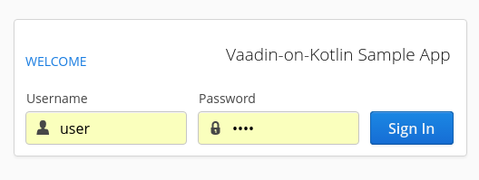

[Index](index.html) | [Getting Started](gettingstarted.html) | [Guides](vok-guides.html)

# Getting started with Vaadin-on-Kotlin Vaadin 10

This guide covers getting up and running with Vaadin On Kotlin (VoK).

> **Note:** This tutorial is heavily inspired by the excellent [Ruby on Rails tutorial](http://guides.rubyonrails.org/getting_started.html). 

After reading this guide, you will know:

* How to create a new VoK application, and connect your application to a database.
* The general layout of a VoK application.
* How to quickly write the starting pieces of a VoK application.

> **Note:** To skip the introduction and dive straight into the code, just skip to [Chapter 3.2](#3_2)

## Guide Assumptions

This guide is designed for beginners who want to get started with a VoK application from scratch.
It does not assume that you have any prior experience with Vaadin. However, to get the most out of it,
you need to have some prerequisites installed:

* Java 8 JDK or newer.

VoK is an opinionated web application framework which employs Vaadin framework running on the Kotlin programming language. If you have no 
prior experience with Kotlin, you will find a very steep learning curve diving straight 
into VoK. There are several curated lists of online resources for learning Kotlin:

* [Official Kotlin Programming Language website](https://kotlinlang.org/)
* [Kotlin Koans](https://kotlinlang.org/docs/tutorials/koans.html)

Vaadin lets you forget the web and program user interfaces much like you would program a desktop application with conventional Java toolkits such as AWT, Swing, or SWT. But easier.
To learn Vaadin:

* [Official Vaadin website](https://www.vaadin.com)
* [Vaadin 10 Documentation](https://vaadin.com/docs/v10/flow/Overview.html) - we recommend to download and read the Vaadin Book PDF.

> **Note:** If you have no prior experience with Kotlin nor Vaadin, you might get overwhelmed by the sheer amount of 
the new stuff we will learn. Therefore, we recommend to take slow steps and get familiar with both Vaadin and Kotlin first.
You can learn Kotlin by doing the [Kotlin Koans](https://kotlinlang.org/docs/tutorials/koans.html); you can learn Vaadin by reading the
[Vaadin 10 Documentation](https://vaadin.com/docs/v10/flow/Overview.html). You can then experiment on the [Karibu-DSL Hello World Example](https://github.com/mvysny/karibu-helloworld-application) at any time:
VoK basically uses Karibu-DSL under the hood, therefore the lessons learned in the _Karibu-DSL Hello World_ example will
be very useful in the VoK-based apps later on.

## What is Vaadin-on-Kotlin?

VoK is a glue between Vaadin, Kotlin and other frameworks which allows you to write web apps smoothly. 
It is designed to make the art of programming of web applications easier by making assumptions about what 
every developer needs to get started. It allows you to write less code while accomplishing 
more than many other languages and frameworks.

VoK is opinionated software. It makes the assumption that there is a "best" way to do things,
and it's designed to encourage that way - and in some cases to discourage alternatives.

The VoK philosophy includes three major guiding principles:

* Simplicity - things are kept as simple as possible, and libraries are used only when absolutely necessary. Complex patterns such as Dependency Injection
  and MVC are deliberately left out.
* Components as basic building blocks - Vaadin is a single-page web component framework as opposed to
  the traditional multiple page frameworks. As such, it resembles the traditional fat client
  Swing/JavaFX programming and is closer to GUI software development than the traditional web development with HTML and JavaScript.
  VoK promotes code/UI reuse by means of reusing components (your components will range from basic ones
  to a complex containers, even forms) instead of creating page templates. It is a predecessor to the Web Components technology.
* No magic - No proxies, interceptors, reflection. VoK introduces explicit functions which you can easily
  browse for sources in your Intellij IDEA.

### Notes For Java Programmers

Traditionally both JavaEE and Spring acted as this "glue" which held various frameworks together.
But, with the advent of the Kotlin programming language,
we believe that the features of the Kotlin programming language alone are all that's necessary in the modern programming.
We believe that the era of traditional approach of using the Dependency Injection, Annotations and auto-discovery magic is over and
the Kotlin programming language itself is all that's needed to glue stuff together.

While the Dependency Injection (DI) itself is not hard to understand, it comes with unfortunate consequences:
* The DI forces the programmer to create Services/DAOs even for tiny CRUD operations. While having Services may be a desirable
practice in larger project, it is overkill for simple projects.
* The DI requires you to run on a DI container, such as a JavaEE server, or tons of Spring libraries. While that's nothing
  new for a seasoned Java developer, this is overwhelming for a newbie which is just starting with the web app development.
* It quickly tends to get very complex as the DI configuration grows.

Therefore, VoK itself is not using DI; you can of course use Spring or JavaEE in your project alongside VoK if necessary.

> **Note on MVC**: The [Model-View-Controller](https://en.wikipedia.org/wiki/Model%E2%80%93view%E2%80%93controller) pattern
is very popular with page-oriented frameworks such as Ruby on Rails, Groovy on Grails and Python Django. There is typically
lot of things going on in the page, and the MVC pattern helps keeping the code separated into smaller,
more easily digestable packages.
>
> However, since Components are a much smaller unit of reuse than pages, employing MVC with Component-oriented frameworks
does not make that much sense: for example it will usually leave you with nearly empty Views. We thus believe that using MVC does
more harm than good since it adds unnecessary complexity. Therefore this tutorial will not use MVC.

## Creating a New VoK Project
The best way to read this guide is to follow it step by step. All steps are essential to run this example application and no additional code or steps are needed.

By following along with this guide, you'll create a VoK project called blog, a (very) simple weblog.
Before you can start building the application, you need to make sure that you have Java 8 JDK installed.

### Prerequisites

Vaadin-on-Kotlin only requires Java 8 JDK to be installed. The example application has Gradle bundled in;
Gradle will then download everything else (Vaadin, Kotlin, libraries, the Jetty server which is used to run the app from the command line).
This makes VoK applications really portable
since they work flawlessly on any OS and CPU which supports Java 8 - be it Windows, Linux or Mac, on x86, ARM or others.

The example application also uses an embedded Java database called [H2](http://www.h2database.com/html/main.html), so there
is no need for you to set up any database.

While it is possible to edit the project files using any text editor, we recommend to install Intellij IDEA which provides awesome
Kotlin support including auto-completion. You can use IDEA Community edition, which is free and allows you to run
gradle tasks to run the app, or you can purchase the Ultimate edition which also supports debugging/hot-redeployment of the web app on Tomcat and other
servers, and also offers awesome database integration tools.

### Creating the Blog Application<a name="3_2"></a>

Getting the example application is really easy. If you have Git installed, just open a command line and run the
following command:

```bash
$ git clone https://github.com/mvysny/vok-helloworld-app-v10
```
If you don't have Git, you can simply download the application as a zip file from GitHub: [https://github.com/mvysny/vok-helloworld-app-v10/archive/master.zip](https://github.com/mvysny/vok-helloworld-app-v10/archive/master.zip).

After you create the blog application, switch to its folder:

```bash
$ cd vok-helloworld-app-v10
$ ./gradlew
```

This will download everything necessary and will compile the example application's WAR file.

> **Note:** WAR (Web ARchive) is Java standard for packaging web applications. WAR file is a zip file which
can be deployed to all Java Servlet Servers, including Tomcat, JBoss etc.

The `vok-helloworld-app-v10` directory has a number of files and folders that make up the
structure of a VoK application. Most of the work in this tutorial will happen in the
`src/main/kotlin` folder, but here's a basic rundown on the function of each of the files and 
folders:

| File/Folder       | Purpose                                 |
|-------------------|-----------------------------------------|
| `web/src/main/kotlin` | Contains the source files of all of your views, Servlets, REST endpoints, async jobs for your application. You'll focus on this folder for the remainder of this guide. |
| `web/src/main/webapp` | Contains the 'Chuck Norris' image file
| `web/src/main/resources` | Contains the logger configuration file (`logback.xml`) |
| `build.gradle`    | This file defines tasks that can be run from the command line. You should add your own tasks by adding code to this file. There is much you can do with Gradle - you can for example use the ssh plugin to deploy the WAR to your production environment. |
| `README.md`       | This is a brief instruction manual for your application. You should edit this file to tell others what your application does, how to set it up, and so on. |
| .gitignore        | This file tells git which files (or patterns) it should ignore. See [Github - Ignoring files](https://help.github.com/articles/ignoring-files/) for more info about ignoring files. |

## Hello, Vaadin-on-Kotlin!<a name="4"></a>

To begin with, let's get some text up on screen quickly. To do this, you need to get a web server running.

### Starting up the Web Server

You actually have a functional VoK application already. To see it, you need to start a web server on your development machine.
You can do this by running the following in the `vok-helloworld-app-v10` directory:

```bash
$ ./gradlew clean web:appRun
```

This will fire up Jetty, an embeddable Java web server. To see your application in action, open a browser window and navigate
 to [http://localhost:8080](http://localhost:8080). You should see the Vaadin-on-Kotlin default information page:


> **Note:** To stop the web server, hit Ctrl+C in the terminal window where it's running. To verify the server has stopped
you should see your command prompt cursor again. For most UNIX-like systems including macOS this will be a dollar sign $.

> **Note:** Changes made in your Kotlin files will be propagated to the running server only after you compile them, by
 running `./gradlew build`.

The "Welcome aboard" page is the smoke test for a new VoK application: it makes sure that you
have your software configured correctly enough to serve a page.

### Say "Hello", Vaadin

To get VoK saying "Hello", you need to create a route.

A route's purpose is to provide a Vaadin Component (usually a layout containing other components), which then interacts with the user.
The Route Registry decides which view receives which requests. Usually there is exactly one route to a view. You can collect the data
to be displayed right in the view itself (for small applications), or you can define so-called Service layer
(a group of regular Kotlin classes which define a clear API and are responsible for fetching of the data).
VoK however does not enforce this, and we will not use this pattern in the tutorial.

All Vaadin Components have two parts:

* Their JavaScript-based client side Web Component which you usually can not use directly;
* A server side class which you access from your code.

For example, a Button Web Component ([`vaadin-button`](https://vaadin.com/components/vaadin-button)) contains the logic to send the notification about the mouse click
to all JavaScript listeners; server-side `Button` registers the JavaScript listener, transfers the event server-side and allows you to register server-side listeners which listen for button clicks.

Another example: [`vaadin-grid`](https://vaadin.com/components/vaadin-grid) shows a list of data in tabular fashion; it performs scrolling and fetching of the data as the user scrolls, via a data provider.
Server-side `Grid` allows you to set the `DataProvider` which will actually fetch the data, from the database or from anywhere, depending on how you implement it.

To create a new view, all that's needed is to create a Kotlin class which is annotated with the `@Route` annotation and extends
some Vaadin Component.

Create the `web/src/main/kotlin/com/example/vok/MyWelcomeView.kt` file and make sure it looks like follows:

```kotlin
package com.example.vok

import com.github.mvysny.karibudsl.v10.*
import com.vaadin.flow.component.orderedlayout.VerticalLayout
import com.vaadin.flow.router.Route

@Route("")
class MyWelcomeView: VerticalLayout() {
    init {
        h1("Hello, Vaadin-on-Kotlin!")
    }
}
```

### Setting the Application Home Page
Now that we have made the view, we need to tell VoK when we want "Hello, Vaadin-on-Kotlin!"
to show up. In our case, we want it to show up when we navigate to the root URL of our site,
[http://localhost:8080](http://localhost:8080). At the moment, "Welcome aboard" is occupying that spot.

Open up the `WelcomeView.kt` file and change the `@Route("")` annotation to the following:
`@Route("old-welcome")`. This will map the original "Welcome aboard" page to
[http://localhost:8080/old-welcome](http://localhost:8080/old-welcome) , making space for our new Hello page.

Having the `@Route("")` on `MyWelcomeView` will tell the Vaadin Route Registry to map requests to the root of the application to the `MyWelcomeView` view.

Launch the web server again and navigate to [http://localhost:8080](http://localhost:8080) in your browser. You'll see the "Hello, Vaadin-on-Kotlin!"
message you put into the `web/src/main/kotlin/com/example/vok/MyWelcomeView.kt`, indicating
that this new route is indeed going to `MyWelcomeView` and is rendering the view correctly.

## Getting Up and Running

Now that you've seen how to create a view, let's create something with a bit more substance.

In the Blog application, you will now create a new database table, or in REST terms, a resource. A resource is the term used
for a collection of similar objects, such as articles, people or animals. You can create,
read, update and destroy items for a resource and these operations are referred to as
CRUD operations.

VoK provides a resources method which can be used to declare a standard REST resource. But first, let us define the article.
Create the `web/src/main/kotlin/com/example/vok/Article.kt` file with the following contents:

```kotlin
package com.example.vok

import com.github.vokorm.*

data class Article(
        override var id: Long? = null,

        var title: String? = null,

        var text: String? = null
) : Entity<Long> {
    companion object : Dao<Article>
}
```

This will define a so-called entity class, which basically represents a row in the "Article" database table.

We can now implement the REST endpoint for REST clients to access the article resource.

> **Note:** This step is completely optional and is actually not used by Vaadin, since
Vaadin Flow uses its own internal JSON protocol to communicate with components.
Having REST may come handy though, since we can use it to examine the state of the database
(using the `curl` or `wget` tools).

Just create a file `web/src/main/kotlin/com/example/vok/ArticleRest.kt` which will look as follows:

```kotlin
package com.example.vok

import com.github.mvysny.karibudsl.v10.getAll
import com.github.vokorm.*
import io.javalin.Javalin
import io.javalin.NotFoundResponse

fun Javalin.articleRest() {
    get("/rest/articles/:id") { ctx ->
        val id = ctx.pathParam("id").toLong()
        ctx.json(Article.findById(id) ?: throw NotFoundResponse("No article with id $id"))
    }
    get("/rest/articles") { ctx -> ctx.json(Article.findAll()) }
}
```

In order to take these REST endpoints into use, in the `Bootstrap.kt`, edit the `configureRest()` function at the end of the file and make sure it calls our `articleRest()` function:

```kotlin
fun Javalin.configureRest(): Javalin {
    val gson = GsonBuilder().create()
    gson.configureToJavalin()
    articleRest()
    return this
}
```

This will add the possibility to retrieve the articles via a REST call. Just try

```bash
$ wget localhost:8080/rest/articles
```

You will get 500 internal server error; the server log will show a long stacktrace, with the most interesting
part being
```
Caused by: org.h2.jdbc.JdbcSQLException: Table "ARTICLE" not found; SQL statement:
select * from Article [42102-196]
	at org.h2.message.DbException.getJdbcSQLException(DbException.java:345)
	at org.h2.message.DbException.get(DbException.java:179)
	at org.h2.message.DbException.get(DbException.java:155)
```

That is to be expected since we haven't yet created the table for Articles. We'll do that in a minute.
In the next section, you will add the ability to create new articles in your application and be able to view them. This is the "C" and the "R" from CRUD: create and read. The form for doing this will look like this:


It will look a little basic for now, but that's ok. We'll look at improving the styling for it afterwards.

### Laying down the groundwork

Firstly, you need a place within the application to create a new article. A great place for that
would be at `create-article`. Navigate to [http://localhost:8080/create-article](http://localhost:8080/create-article) and you'll see a general error:


This happens because there is no View yet, mapped to the `create-article` route.

### The first form

The solution to this particular problem is simple:
create a Kotlin file named `web/src/main/kotlin/com/example/vok/CreateArticleView.kt` as follows:

```kotlin
package com.example.vok

import com.github.mvysny.karibudsl.v10.*
import com.vaadin.flow.component.orderedlayout.VerticalLayout
import com.vaadin.flow.router.Route

@Route("create-article")
class CreateArticleView: VerticalLayout() {
    private val binder = beanValidationBinder<Article>()
    init {
        h1("New Article")
        textField("Title") {
            bind(binder).bind(Article::title)
        }
        textArea("Text") {
            bind(binder).bind(Article::text)
        }
        button("Save Article")
    }
}
```
If you restart the server and refresh the page now, you'll see the exact same form from our example above.
Building forms in VoK is really just that easy!

There is a problem with the form though - when you click the "Save Article" button, nothing will happen.
Currently, the click listener is empty, we will need to add the database code to save the article.

### Creating articles

To make the "Save Article" button do something, just change the class as follows:
```kotlin
package com.example.vok

import com.github.mvysny.karibudsl.v10.*
import com.vaadin.flow.component.orderedlayout.VerticalLayout
import com.vaadin.flow.router.Route

@Route("create-article")
class CreateArticleView: VerticalLayout() {
    private val binder = beanValidationBinder<Article>()
    init {
        h1("New Article")
        textField("Title") {
            bind(binder).bind(Article::title)
        }
        textArea("Text") {
            bind(binder).bind(Article::text)
        }
        button("Save Article") {
            onLeftClick {
                val article = Article()
                if (binder.writeBeanIfValid(article)) {
                    article.save()
                }
            }
        }
    }
}
```

Now when you click the "Save Article" button, you'll see an "Internal Error" notification - it's because we haven't
created the database table for Article yet.

### Creating the Article model

Luckily, we have already created the model - it's the `Article` entity class.
We will use [VoK-ORM](https://github.com/mvysny/vok-orm) which will map
the Article object to a relational database. By default it will map to the "Article" table.
To create the table, we will have to create the migration.

> **Note:** Sql2o is smart enough to automatically map column names to the Article class properties,
which means you don't have to provide the database name for every property
inside entities, as that will be done automatically by Sql2o.

To create the migration, create a file named `V01__CreateArticle.sql` in the `web/src/main/resources/db/migration` directory, with the following contents:

```sql
create table Article(
  id bigint auto_increment PRIMARY KEY,
  title varchar(200) NOT NULL,
  text varchar(4000) NOT NULL
);
```

This is a SQL data definition (DDL) script which will create a table named Article with three columns. We are using the H2 database
SQL dialect here.

### Running a Migration

As we've just seen, migrations are simple SQL scripts which create and modify database tables. The database migration is done automatically,
on the web app startup, by the `Bootstrap` class.  You can also reconfigure your app to do the migrations manually instead,
simply by commenting out relevant part of the `Bootstrap` class and altering the `build.gradle` file as stated in the
[Flyway Gradle documentation](https://flywaydb.org/getstarted/firststeps/gradle).

If you look in the `V01__CreateArticle.sql` file, you'll see the `V01` prefix, followed by two underscores, and then the name.
The name may be arbitrary, and it doesn't affect the migration outcome. The number defines the ordering -
migration scripts will be run sorted by the version number, and exactly once. You can read more about the exact numbering
rules in the [Flyway Versioned Migrations Guide](https://flywaydb.org/documentation/migration/versioned).

When Flyway runs this migration it will create an articles table with one string column and a text column.

At this point, you can simply kill and restart the server, to automatically run all migrations.
Since we are currently using an in-memory H2 database, its contents are gone when the server is killed,
and since we are starting with a fresh database, all migrations will run. When we'll use a persistent database,
Flyway will make sure that only a newly defined migrations are run.

### Saving data in the CreateArticleView

Back in `CreateArticleView` view, everything is ready. Try clicking the "Save Article" button - seemingly nothing
will happen, but the article will be saved into the database. To actually see the article,
we will redirect to an `ArticleView` which we'll define later.

> **Note:** You might be wondering why the A in Article is capitalized
above, whereas most other references to articles in this guide have used lowercase.
In this context, we are referring to the class named Article that is defined in `web/src/main/kotlin/com/example/vok/Article.kt`.
Class names in Kotlin must begin with a capital letter.

> **Note:** As we'll see later, `binder.writeBeanIfValid()` returns a boolean indicating whether the article was saved or not.

### Showing Articles

If you submit the form again now, VoK will just stay on the form. That's
not very useful though, so let's add the show action before proceeding.

Vaadin 10 supports adding parameters after the view name. This way, we
can pass the Article ID to the `ArticleView` as follows:
[http://localhost:8080/article/12](http://localhost:8080/article/12). As
we did before, we need to add the `web/src/main/kotlin/com/example/vok/ArticleView.kt` file:
```kotlin
package com.example.vok

import com.github.mvysny.karibudsl.v10.*
import com.github.vokorm.getById
import com.vaadin.flow.component.*
import com.vaadin.flow.component.orderedlayout.VerticalLayout
import com.vaadin.flow.router.*

@Route("article")
class ArticleView: VerticalLayout(), HasUrlParameter<Long> {
    private lateinit var title: Text
    private lateinit var text: Text
    init {
        div {
            strong("Title: ")
            this@ArticleView.title = text("")
        }
        div {
            strong("Text: ")
            this@ArticleView.text = text("")
        }
    }

    override fun setParameter(event: BeforeEvent, articleId: Long?) {
        val article = Article.getById(articleId!!)
        title.text = article.title
        text.text = article.text
    }

    companion object {
        fun navigateTo(articleId: Long) = navigateToView(ArticleView::class, articleId)
    }
}
```
A couple of things to note. We use `Article.getById(id)` to find the article we're interested in,
passing in `articleId` to get the first parameter from the request. In Vaadin, the parameter is passed to the `navigateToView()` function
which takes the view class and a parameter as its input, constructs the target URL
and redirects the browser to the URL. In this case, [http://localhost:8080/article/12](http://localhost:8080/article/12).

The router then detects that the URL has been changed, it parses the view name out of the URL and
invokes the `view.setParameter()` method. The parameter is passed as the second argument of the `setParameter()` function.

To navigate to the Article View, just add `ArticleView.navigateTo(article.id!!)` to your `CreateArticleView.kt` file,
right below the `article.save()` call as follows:

```kotlin
...
        button("Save Article") {
            onLeftClick {
                val article = Article()
                if (binder.writeBeanIfValid(article)) {
                    article.save()
                    ArticleView.navigateTo(article.id!!)
                }
            }
        }
...
```

With this change, you should finally be able to create new articles. Visit
[http://localhost:8080/create-article](http://localhost:8080/create-article) and give it a try!


### Listing All Articles

We still need a way to list all our articles, so let's do that. We'll create the `web/src/main/kotlin/com/examples/vok/ArticlesView.kt` with the
following contents:

```kotlin
package com.example.vok

import com.github.mvysny.karibudsl.v10.*
import com.vaadin.flow.component.grid.Grid
import com.vaadin.flow.component.orderedlayout.VerticalLayout
import com.vaadin.flow.router.*
import eu.vaadinonkotlin.vaadin10.sql2o.dataProvider

@Route("articles")
class ArticlesView: VerticalLayout(), AfterNavigationObserver {
    private val grid: Grid<Article>
    init {
        setSizeFull()
        h1("Listing Articles")
        grid = grid(dataProvider = Article.dataProvider) {
            isExpand = true; setSizeFull()
            addColumnFor(Article::id)
            addColumnFor(Article::title)
            addColumnFor(Article::text)
        }
    }

    override fun afterNavigation(event: AfterNavigationEvent) {
        grid.refresh()
    }
}
```

Now if you go to [http://localhost:8080/articles](http://localhost:8080/articles) you will see a list of all the articles that you have created.
Note that we have used the Grid component. Grid is a powerful tabular component which supports paging and lazy-loading of the data,
including sorting and filtering.

### Adding links
You can now create, show, and list articles. Now let's add some links to navigate through pages.

Open `web/src/main/kotlin/com/example/vok/MyWelcomeView.kt` and modify its `init {}` contents as follows:

```kotlin
    init {
        verticalLayout {
            h1("Hello, Vaadin-on-Kotlin!")
            routerLink(null, "My Blog", ArticlesView::class)
        }
    }
```

The Vaadin `RouterLink` component creates a hyperlink based on text to display and where to go - in this case, to the path for articles.

Let's add links to the other views as well, starting with adding this "New Article" link to `ArticlesView` class, placing it above the `grid` declaration:

```kotlin
        routerLink(null, "New Article", CreateArticleView::class)
```

This link will allow you to bring up the form that lets you create a new article.

Now, add another link in `CreateArticleView`, underneath the form's "Save Article" button, as the last line of the `init{}` block, to go back to the index action:

```kotlin
        routerLink(null, "Back", ArticlesView::class)
```

Finally, add a link to the `ArticleView` view to go back to the index action as well (into the `init{}` block under those labels), so that people who are viewing a single article can go back and view the whole list again:

```kotlin
        routerLink(null, "Back", ArticlesView::class)
```

> **Note:** remember, when you are running the server via `./gradlew web:appRun`, you will either need to kill the server and re-run again,
or you'll need to run `./gradlew build` in another terminal, to actually see the outcome of your changes.

### Adding Some Validation

The entity file, `Article.kt` is about as simple as it can get.

There isn't much to this file - but both Sql2o and Vaadin-on-Kotlin supplies a great deal of functionality to your entities for free, including basic database CRUD (Create, Read, Update, Destroy) operations, data validation, as well as sophisticated search support and the ability to relate multiple models to one another.

Vaadin-on-Kotlin includes methods to help you validate the data that you send to models.
Open the `Article.kt` file and edit it:

```kotlin
package com.example.vok

import com.github.vokorm.*
import org.hibernate.validator.constraints.Length
import javax.validation.constraints.NotNull

data class Article(
        override var id: Long? = null,

        @field:NotNull
        @field:Length(min = 5)
        var title: String? = null,

        @field:NotNull
        @field:Length(min = 2)
        var text: String? = null
) : Entity<Long> {
    companion object : Dao<Article>
}
```

These changes will ensure that all articles have a title that is at least five characters long.
VoK can validate a variety of conditions in an entity, including the presence or uniqueness
of columns, their format, and the existence of associated objects. The [Hibernate Validator](http://hibernate.org/validator/) is used
to provide validation support; validations are covered
in detail in the Hibernate Validator documentation.

With the validation now in place, when you call `binder.writeBeanIfValid(article)` on an invalid
article, it will return `false`. If you open `CreateArticleView.kt`
again, you'll notice that we actually check the result of calling `binder.writeBeanIfValid(article)`
inside the create action. However, if `writeBeanIfValid()` fails, we need to show the form back to the user,
and mark all invalid fields. To do this, change the button definition as follows:

```kotlin
        button("Save Article") {
            onLeftClick {
                val article = Article()
                if (binder.validate().isOk && binder.writeBeanIfValid(article)) {
                    article.save()
                    ArticleView.navigateTo(article.id!!)
                }
            }
        }
```

If you reload [http://localhost:8080/create-article](http://localhost:8080/create-article) and try to save an article without a title,
VoK will send you back to the form, with the invalid fields marked red.
The `binder.validate().isOk` call will mark invalid fields, while `binder.writeBeanIfValid(article)` will write the values to
the `article` entity, but only if everything is valid.

### Updating Articles

We've covered the "CR" part of CRUD. Now let's focus on the "U" part, updating articles.

The first step we'll take is adding the `web/src/main/kotlin/com/example/vok/EditArticleView.kt`:

```kotlin
package com.example.vok

import com.github.mvysny.karibudsl.v10.*
import com.github.vokorm.getById
import com.vaadin.flow.component.orderedlayout.VerticalLayout
import com.vaadin.flow.router.*

@Route("edit-article")
class EditArticleView: VerticalLayout(), HasUrlParameter<Long> {
    private val binder = beanValidationBinder<Article>()
    private var article: Article? = null
    init {
        h1("Edit Article")
        textField("Title") {
            bind(binder).bind(Article::title)
        }
        textArea("Text") {
            bind(binder).bind(Article::text)
        }
        button("Save Article") {
            onLeftClick { event ->
                val article = article!!
                if (binder.validate().isOk && binder.writeBeanIfValid(article)) {
                    article.save()
                    ArticleView.navigateTo(article.id!!)
                }
            }
        }
        routerLink(null, "Back", ArticlesView::class)
    }

    override fun setParameter(event: BeforeEvent, articleId: Long?) {
        edit(Article.getById(articleId!!))
    }

    private fun edit(article: Article) {
        this.article = article
        binder.readBean(article)
    }

    companion object {
        fun navigateTo(articleId: Long) = navigateToView(EditArticleView::class, articleId)
    }
}
```

The view will contain a form similar to the one we used when creating new articles. The only difference is that
when the view is entered (that is, navigated to), it looks up the article ID, loads the article and binds
it with the components.

Finally, we want to show a link to the edit action in the list of all the articles, so let's add
that now to `ArticlesView.kt` to make it appear next to the "Show" link.
Just change the `grid {}` block as follows:

```kotlin
        grid = grid(dataProvider = Article.dataProvider) {
            isExpand = true; setSizeFull()
            addColumnFor(Article::id)
            addColumnFor(Article::title)
            addColumnFor(Article::text)
            addColumn(NativeButtonRenderer<Article>("Show", { ArticleView.navigateTo(it.id!!) }))
            addColumn(NativeButtonRenderer<Article>("Edit", { EditArticleView.navigateTo(it.id!!) }))
        }
```

> **Note**: The `NativeButtonRenderer` will be marked red; you will need to import the class. You can do that simply by pressing `Alt+Enter`
and choosing *Import* from the menu.

And we'll also add one to the `ArticleView.kt` template as well, so that there's also an "Edit" link on an article's page. Modify the class to look as follows:

```kotlin
package com.example.vok

import com.github.mvysny.karibudsl.v10.*
import com.github.vokorm.getById
import com.vaadin.flow.component.*
import com.vaadin.flow.component.orderedlayout.VerticalLayout
import com.vaadin.flow.router.*

@Route("article")
class ArticleView: VerticalLayout(), HasUrlParameter<Long> {
    private val editLink: RouterLink
    private lateinit var title: Text
    private lateinit var text: Text
    init {
        div {
            strong("Title: ")
            this@ArticleView.title = text("")
        }
        div {
            strong("Text: ")
            this@ArticleView.text = text("")
        }
        editLink = routerLink(null, "Edit")
        routerLink(text = "Back", viewType = ArticlesView::class)
    }

    override fun setParameter(event: BeforeEvent, articleId: Long?) {
        val article = Article.getById(articleId!!)
        title.text = article.title
        text.text = article.text
        editLink.setRoute(EditArticleView::class, articleId)
    }

    companion object {
        fun navigateTo(articleId: Long) = navigateToView(ArticleView::class, articleId)
    }
}
```

And here's how our app looks so far:


### Creating components to clean up duplication in views

Our `EditArticleView` view looks very similar to the `CreateArticleView` view; in fact,
they both share the same code for displaying the form.
Let's remove this duplication by using a common component.

Create a new file `web/src/main/kotlin/com/example/vok/ArticleEditor.kt` with the following content:

```kotlin
package com.example.vok

import com.github.mvysny.karibudsl.v10.*
import com.vaadin.flow.component.HasComponents
import com.vaadin.flow.component.orderedlayout.VerticalLayout

class ArticleEditor : VerticalLayout() {
    private val binder = beanValidationBinder<Article>()
    var article: Article? = null
        set(value) {
            field = value
            if (value != null) binder.readBean(value)
        }

    init {
        isMargin = false
        textField("Title") {
            bind(binder).bind(Article::title)
        }
        textArea("Text") {
            bind(binder).bind(Article::text)
        }
        button("Save Article") {
            onLeftClick { event ->
                val article = article!!
                if (binder.validate().isOk && binder.writeBeanIfValid(article)) {
                    article.save()
                    ArticleView.navigateTo(article.id!!)
                }
            }
        }
        routerLink(null, "Back", ArticlesView::class)
    }
}

fun HasComponents.articleEditor(block: ArticleEditor.()->Unit = {}) = init(ArticleEditor(), block)
```

This is just an ordinary Vaadin component which you can insert anywhere into your View. Its API consists of a single public
property named `article`. When you assign this property, the `ArticleEditor` will populate the fields and the user will be
able to edit the article.
When you press the "Save Article" button, the `ArticleEditor` component will either create a new article, or update an existing one.

The function `HasComponents.articleEditor()` looks interesting. The function has been specially crafted in a way that allows us to
build Vaadin UIs in a structured way, using purely Kotlin code.
This technique is called DSL (Domain Specific Language). The name fits - in a way we have constructed
a 'language' used to create Vaadin UIs. You can find more information about the Kotlin DSL at the [Kotlin Type-Safe Builders](https://kotlinlang.org/docs/reference/type-safe-builders.html).

Using type-safe builders or DSL has the advantage that the Kotlin compiler will check
for typos, and the Kotlin IDEA plugin will help us with the auto-completion.

> **Note:** The [Karibu-DSL](https://github.com/mvysny/karibu-dsl) library actually defines such builder functions for every Vaadin component.
You can check the [Basic.kt](https://github.com/mvysny/karibu-dsl/blob/master/karibu-dsl-v8/src/main/kotlin/com/github/vok/karibudsl/Basic.kt) file
for the definitions of the sources for the `button` and `textField` builder methods.

Now, let's update the `CreateArticleView.kt` view to use this new component, rewriting it completely:

```kotlin
package com.example.vok

import com.github.mvysny.karibudsl.v10.*
import com.vaadin.flow.component.orderedlayout.VerticalLayout
import com.vaadin.flow.router.Route

@Route("create-article")
class CreateArticleView: VerticalLayout() {
    private val editor: ArticleEditor
    init {
        h1("New Article")
        editor = articleEditor {
            article = Article()
        }
    }
}
```

Then do the same for the `EditArticleView.kt` view:

```kotlin
package com.example.vok

import com.github.mvysny.karibudsl.v10.*
import com.github.vokorm.getById
import com.vaadin.flow.component.orderedlayout.VerticalLayout
import com.vaadin.flow.router.*

@Route("edit-article")
class EditArticleView: VerticalLayout(), HasUrlParameter<Long> {
    private val editor: ArticleEditor
    init {
        h1("Edit Article")
        editor = articleEditor()
    }

    override fun setParameter(event: BeforeEvent, articleId: Long?) {
        editor.article = Article.getById(articleId!!)
    }

    companion object {
        fun navigateTo(articleId: Long) = navigateToView(EditArticleView::class, articleId)
    }
}
```

### Deleting Articles

We're now ready to cover the "D" part of CRUD, deleting articles from the database. To delete the article, all that's
needed is to call `delete()` in the article from appropriate place.

We will add a 'Destroy' link to the `ArticlesView.kt` file, to wrap everything together:

```kotlin
package com.example.vok

import com.github.mvysny.karibudsl.v10.*
import com.vaadin.flow.component.grid.Grid
import com.vaadin.flow.component.orderedlayout.VerticalLayout
import com.vaadin.flow.data.renderer.NativeButtonRenderer
import com.vaadin.flow.router.*
import eu.vaadinonkotlin.vaadin10.sql2o.dataProvider

@Route("articles")
class ArticlesView: VerticalLayout(), AfterNavigationObserver {
    private val grid: Grid<Article>
    init {
        setSizeFull()
        h1("Listing Articles")
        routerLink(text = "New Article", viewType = CreateArticleView::class)
        grid = grid(dataProvider = Article.dataProvider) {
            isExpand = true; setSizeFull()
            addColumnFor(Article::id)
            addColumnFor(Article::title)
            addColumnFor(Article::text)
            addColumn(NativeButtonRenderer<Article>("Show", { ArticleView.navigateTo(it.id!!) }))
            addColumn(NativeButtonRenderer<Article>("Edit", { EditArticleView.navigateTo(it.id!!) }))
            addColumn(NativeButtonRenderer<Article>("Destroy", { article ->
                confirmDialog {
                    article.delete()
                    this@grid.refresh()
                }
            }))
        }
    }

    override fun afterNavigation(event: AfterNavigationEvent) {
        grid.refresh()
    }
}
```

The "Destroy" button calls the `confirmDialog` which shows a simple Vaadin dialog. The function is implemented in a way that
it will call the follow-up block when the "Yes" button is clicked. The block will just delete the article
and refresh the Grid, to display the new data. To get rid of the confirmation dialog, just delete the `confirmDialog` line:
```kotlin
            addColumn(NativeButtonRenderer<Article>("Destroy", { article ->
                article.delete()
                this@grid.refresh()
            }))
```

> **Note:** To see the definition of the function,
just open up Intellij IDEA and click your mouse on the `confirmDialog` function name while holding the `Control` key.


Congratulations, you can now create, show, list, update and destroy articles.

## Adding a Second Database Entity

It's time to add a second database table to the application. The second database table will handle comments on articles.

### Creating the 'Comments' Entity

We'll create a `Comment` entity to hold comments for an article. Create the following file: `web/src/main/kotlin/com/example/vok/Comment.kt` with the following contents:

```kotlin
package com.example.vok

import com.github.vokorm.*
import org.hibernate.validator.constraints.Length
import javax.validation.constraints.NotNull

data class Comment(
        override var id: Long? = null,

        var article_id: Long? = null,

        @field:NotNull
        @field:Length(min = 3)
        var commenter: String? = null,

        @field:NotNull
        @field:Length(min = 3)
        var body: String? = null
) : Entity<Long> {
    companion object : Dao<Comment>

    val article: Article? get() = if (article_id == null) null else Article.findById(article_id!!)
}
```

This is very similar to the `Article` entity that you saw earlier. The difference is the property `article`
which sets up an association. You'll learn a little about associations in the next section of this guide.

Note the `article_id` column - it tells which Article the comment belongs to.
You can get a better understanding after analyzing the appropriate migration script. Just create
`web/src/main/resources/db/migration/V02__CreateComment.sql` file with the following contents:

```sql
create TABLE Comment(
  id bigint auto_increment PRIMARY KEY,
  commenter varchar(200) NOT NULL,
  body VARCHAR(4000) NOT NULL,
  article_id bigint not null REFERENCES Article(id)
);
```

The `article_id` line creates an integer column called `article_id`, an index for it, and a
foreign key constraint that points to the `id` column of the articles table. Go ahead and run
the project.

Since we are running an embedded database which starts in a clear state, all migrations will run:

```
15:43:44.532 [RMI TCP Connection(2)-127.0.0.1] INFO  com.example.vok.Bootstrap - Running DB migrations
15:43:44.553 [RMI TCP Connection(2)-127.0.0.1] INFO  o.f.c.internal.util.VersionPrinter - Flyway 4.2.0 by Boxfuse
15:43:44.676 [RMI TCP Connection(2)-127.0.0.1] INFO  o.f.c.i.dbsupport.DbSupportFactory - Database: jdbc:h2:mem:test (H2 1.4)
15:43:44.754 [RMI TCP Connection(2)-127.0.0.1] INFO  o.f.core.internal.command.DbValidate - Successfully validated 2 migrations (execution time 00:00.026s)
15:43:44.767 [RMI TCP Connection(2)-127.0.0.1] INFO  o.f.c.i.m.MetaDataTableImpl - Creating Metadata table: "PUBLIC"."schema_version"
15:43:44.792 [RMI TCP Connection(2)-127.0.0.1] INFO  o.f.core.internal.command.DbMigrate - Current version of schema "PUBLIC": << Empty Schema >>
15:43:44.794 [RMI TCP Connection(2)-127.0.0.1] INFO  o.f.core.internal.command.DbMigrate - Migrating schema "PUBLIC" to version 01 - CreateArticle
15:43:44.813 [RMI TCP Connection(2)-127.0.0.1] INFO  o.f.core.internal.command.DbMigrate - Migrating schema "PUBLIC" to version 02 - CreateComment
15:43:44.823 [RMI TCP Connection(2)-127.0.0.1] INFO  o.f.core.internal.command.DbMigrate - Successfully applied 2 migrations to schema "PUBLIC" (execution time 00:00.057s).
```

However, if we were to use a persistent database, FlyWay would be smart enough to only execute the migrations that have not already been run against the current database.

### Associating Models

Vaadin on Kotlin associations let you easily declare the relationship between two entities. In the case of
comments and articles, you could write out the relationships this way:

* Each comment belongs to one article.
* One article can have many comments.

You've already seen the line of code inside the `Comment` entity (`Comment.kt`) that makes each
comment belong to an `Article`:

```kotlin
    val article: Article? get() = if (article_id == null) null else Article.findById(article_id!!)
```

You'll need to edit `Article.kt` to add the other side of the association:

```kotlin
package com.example.vok

import com.github.vokorm.*
import eu.vaadinonkotlin.vaadin10.sql2o.VokDataProvider
import eu.vaadinonkotlin.vaadin10.sql2o.dataProvider
import eu.vaadinonkotlin.vaadin10.sql2o.withFilter
import org.hibernate.validator.constraints.Length
import javax.validation.constraints.NotNull

data class Article(
        override var id: Long? = null,

        @field:NotNull
        @field:Length(min = 5)
        var title: String? = null,

        var text: String? = null
) : Entity<Long> {
    companion object : Dao<Article>

    val comments: VokDataProvider<Comment> get() = Comment.dataProvider.withFilter { Comment::article_id eq id }
}
```

These two declarations enable a good bit of automatic behavior. For example, if you have a
variable `article` containing an article, you can retrieve all the comments belonging to that article
as an array using `article.comments.getAll()`.

> **Note:** Note that the `comments` field is outside of the `data class` constructor. This is intentional,
since the `comments` field is not really a field but a computed property and thus can not stand as a constructor parameter. `comments` is hence lazy -
it is evaluated every time it is read; reading it causes a database `select` to be run. That's why the `comments` property shouldn't
appear in `Article.toString()`, so that logging a newly created article (which calls `toString()`) won't run a select.
Computed properties also do not appear in the JSON output as returned by the REST services - this way we can prevent polluting of the REST JSON
article output with all comments.

### Exposing Comments via REST

You can expose the comments via the REST interface. This is completely optional and is not used by Vaadin in any way,
it may just be handy to check your database status via the `curl` tool. Edit `ArticleRest.kt`:

```kotlin
package com.example.vok

import com.github.mvysny.karibudsl.v10.getAll
import com.github.vokorm.*
import io.javalin.Javalin
import io.javalin.NotFoundResponse

fun Javalin.articleRest() {
    get("/rest/articles/:id") { ctx ->
        val id = ctx.pathParam("id").toLong()
        ctx.json(Article.findById(id) ?: throw NotFoundResponse("No article with id $id"))
    }
    get("/rest/articles") { ctx -> ctx.json(Article.findAll()) }
    get("/rest/articles/:id/comments") { ctx ->
        val id = ctx.pathParam("id").toLong()
        val article = Article.findById(id) ?: throw NotFoundResponse("No article with id $id")
        ctx.json(article.comments.getAll())
    }
}
```

Now, you can run curl in your terminal:
```bash
$ curl localhost:8080/rest/articles/1/comments
[{"id":1,"commenter":"A buddy programmer","body":"I like Vaadin-on-Kotlin, too!"}]
```

### Writing a view

Like with any blog, our readers will create their comments directly after reading the article, and once they have added their comment, will be sent back to the article show page to see their comment now listed.

So first, we'll wire up the `ArticleView.kt` view to let us make a new comment:

```kotlin
package com.example.vok

import com.github.mvysny.karibudsl.v10.*
import com.github.vokorm.getById
import com.vaadin.flow.component.*
import com.vaadin.flow.component.button.Button
import com.vaadin.flow.component.html.Div
import com.vaadin.flow.component.orderedlayout.VerticalLayout
import com.vaadin.flow.router.*

@Route("article")
class ArticleView: VerticalLayout(), HasUrlParameter<Long> {
    private lateinit var article: Article
    private val editLink: RouterLink
    private lateinit var title: Text
    private lateinit var text: Text
    private val comments: Div
    private val commentBinder = beanValidationBinder<Comment>()
    private lateinit var createComment: Button
    init {
        div {
            strong("Title: ")
            this@ArticleView.title = text("")
        }
        div {
            strong("Text: ")
            this@ArticleView.text = text("")
        }
        p("Comments")
        comments = div()
        p("Add a comment:")
        textField("Commenter:") {
            bind(commentBinder).bind(Comment::commenter)
        }
        textField("Body:") {
            bind(commentBinder).bind(Comment::body)
        }
        createComment = button("Create") {
            onLeftClick { createComment() }
        }
        editLink = routerLink(null, "Edit")
        routerLink(text = "Back", viewType = ArticlesView::class)
    }

    override fun setParameter(event: BeforeEvent, articleId: Long?) {
        article = Article.getById(articleId!!)
        title.text = article.title
        text.text = article.text
        editLink.setRoute(EditArticleView::class, articleId)
    }

    private fun createComment() {
        val comment = Comment()
        if (commentBinder.validate().isOk && commentBinder.writeBeanIfValid(comment)) {
            comment.article_id = article.id
            comment.save()
            refreshComments()
            commentBinder.readBean(Comment())  // this clears the comment fields
        }
    }
    private fun refreshComments() {
        comments.removeAll()
        article.comments.getAll().forEach { comment ->
            comments.html("<p><strong>Commenter:</strong>${comment.commenter}</p><p><strong>Comment:</strong>${comment.body}</p>")
        }
    }

    companion object {
        fun navigateTo(articleId: Long) = navigateToView(ArticleView::class, articleId)
    }
}
```

This adds a form on the `Article` show page that creates a new comment, by calling the `comment.save()` code.

Once we have made the new comment, we need to stay on the page of the original article. That's why there is no
`navigate` call in the `createComment()` function. However, since the page does not reload (remember we use the single-page-framework),
we need to refresh the comments ourselves. See the `comments` div? We will populate this div with a html-formatted list of all comments.
This exactly is done by the `refreshComments()` function.

Now you can add articles and comments to your blog and have them show up in the right places.


> **Note:** in the `refreshComments()` the `getAll()` function will re-fetch the fresh list of `comments`; the comments are not cached
in the `Article.comments` field. If you need to access the comment list multiple times, it is best to store the list of comments
into a variable.

## Refactoring

Now that we have articles and comments working, take a look at the `web/src/main/kotlin/com/example/vok/ArticleView.kt` view.
It is getting long and awkward. We can create reusable components to clean it up.

### The Comments Component

First, we will extract a component which will show comments for given article. Since we will need to add a 'delete' link
in the future, the `div` component will no longer suffice. Create the `web/src/main/kotlin/com/example/vok/CommentsComponent.kt` file:
```kotlin
package com.example.vok

import com.github.mvysny.karibudsl.v10.*
import com.github.vokorm.getById
import com.vaadin.flow.component.HasComponents
import com.vaadin.flow.component.orderedlayout.VerticalLayout

class CommentsComponent : VerticalLayout() {
    var articleId: Long = 0L
        set(value) { field = value; refresh() }

    private val comments: VerticalLayout
    init {
        isMargin = false
        p("Comments")
        comments = verticalLayout()
    }

    fun refresh() {
        comments.removeAll()
        Article.getById(articleId).comments.getAll().forEach { comment ->
            comments.div {
                html("<p><strong>Commenter:</strong>${comment.commenter}</p><p><strong>Comment:</strong>${comment.body}</p>")
            }
        }
    }
}
// the extension function which will allow us to use CommentsComponent inside a DSL
fun HasComponents.commentsComponent(block: CommentsComponent.()->Unit = {}) = init(CommentsComponent(), block)
```

The component has a handy property `articleId` which, upon setting, will populate itself with comments
for that particular article.

We also need the means to include the `CommentsComponent` component into the DSL, and thus we have also introduced
the DSL extension method as well. The extension function simply calls the `init()` function, which performs the following things:
* Inserts the newly created component (in this case, the `CommentsComponent`) into the parent layout;
* Calls `block` to optionally allow us to configure the component further.

You can learn more about how DSL works, from the [Writing Vaadin Apps In Kotlin Part 4](http://mavi.logdown.com/posts/1493730) tutorial.

### Converting the Comments Form to a component

Let us also move that new comment section out to its own component. Create the file named
`web/src/main/kotlin/com/example/vok/NewCommentForm.kt` with the following contents:

```kotlin
package com.example.vok

import com.github.mvysny.karibudsl.v10.*
import com.vaadin.flow.component.HasComponents
import com.vaadin.flow.component.button.Button
import com.vaadin.flow.component.orderedlayout.VerticalLayout

class NewCommentForm : VerticalLayout() {
    var commentCreatedListener: ()->Unit = {}
    lateinit var article: Article
    private val commentBinder = beanValidationBinder<Comment>()
    private val createComment: Button
    init {
        text("Add a comment:")
        textField("Commenter:") {
            bind(commentBinder).bind(Comment::commenter)
        }
        textField("Body:") {
            bind(commentBinder).bind(Comment::body)
        }
        createComment = button("Create") {
            onLeftClick { createComment() }
        }
    }

    private fun createComment() {
        val comment = Comment()
        if (commentBinder.validate().isOk && commentBinder.writeBeanIfValid(comment)) {
            comment.article_id = article.id
            comment.save()
            commentBinder.readBean(Comment())  // this clears the comment fields
            commentCreatedListener()
        }
    }
}
fun HasComponents.newCommentForm(block: NewCommentForm.()->Unit = {}) = init(NewCommentForm(), block)
```

The component handles the comment creation now. In order for the component to work properly, the article for which the comment is to be created must be set.
Also, when the component creates the comment, it needs to notify the `ArticleView` about this fact. This is done by the means of the
`commentCreatedListener` listener which the component calls upon comment creation. Now, let's refactor the `ArticleView.kt`
to make use of the `NewCommentForm` component, and register itself to `NewCommentForm` as a listener:

```kotlin
package com.example.vok

import com.github.mvysny.karibudsl.v10.*
import com.github.vokorm.getById
import com.vaadin.flow.component.*
import com.vaadin.flow.component.orderedlayout.VerticalLayout
import com.vaadin.flow.router.*

@Route("article")
class ArticleView: VerticalLayout(), HasUrlParameter<Long> {
    private val editLink: RouterLink
    private lateinit var title: Text
    private lateinit var text: Text
    private val comments: CommentsComponent
    private val newComment: NewCommentForm
    init {
        div {
            strong("Title: ")
            this@ArticleView.title = text("")
        }
        div {
            strong("Text: ")
            this@ArticleView.text = text("")
        }
        comments = commentsComponent()
        newComment = newCommentForm {
            commentCreatedListener = { comments.refresh() }
        }
        editLink = routerLink(null, "Edit")
        routerLink(text = "Back", viewType = ArticlesView::class)
    }

    override fun setParameter(event: BeforeEvent, articleId: Long?) {
        val article = Article.getById(articleId!!)
        newComment.article = article
        comments.articleId = articleId
        title.text = article.title
        text.text = article.text
        editLink.setRoute(EditArticleView::class, articleId)
    }

    companion object {
        fun navigateTo(articleId: Long) = navigateToView(ArticleView::class, articleId)
    }
}
```

## Deleting Comments

Another important feature of a blog is being able to delete spam comments. To do this, we need to implement a link of some sort in the `CommentsComponent`.

Let's add a link button to the `CommentsComponent.kt` file:

```kotlin
package com.example.vok

import com.github.mvysny.karibudsl.v10.*
import com.github.vokorm.getById
import com.vaadin.flow.component.HasComponents
import com.vaadin.flow.component.orderedlayout.VerticalLayout

class CommentsComponent : VerticalLayout() {
    var articleId: Long = 0L
        set(value) { field = value; refresh() }

    private val comments: VerticalLayout
    init {
        isMargin = false
        p("Comments")
        comments = verticalLayout()
    }

    fun refresh() {
        comments.removeAll()
        Article.getById(articleId).comments.getAll().forEach { comment ->
            comments.div {
                html("<p><strong>Commenter:</strong>${comment.commenter}</p><p><strong>Comment:</strong>${comment.body}</p>")
            }
            comments.button("Delete comment") {
                themes.add("tertiary small")
                onLeftClick { comment.delete(); refresh() }
            }
        }
    }
}
// the extension function which will allow us to use CommentsComponent inside a DSL
fun HasComponents.commentsComponent(block: CommentsComponent.()->Unit = {}) = init(CommentsComponent(), block)
```

Clicking the "Delete comment" button will delete the comment and refresh the component, to show the rest of the comments.

### Deleting Associated Objects

If you delete an article, its associated comments will also need to be deleted, otherwise they would simply occupy space in the database.
Or even worse, since we have the foreign constraint set up, the database would fail to delete the article. We will need to modify the
`Article.delete()` method to do that for us.
Modify the `Article.kt` file and add the `delete` function right below the `comments` val, as follows:

```kotlin
    override fun delete() = db {
        Comment.deleteBy { Comment::article_id eq id }
        super.delete()
    }
```

## Security

If you were to publish your blog online, anyone would be able to add, edit and delete articles or delete comments.

### The Login Dialog

Adding security to Java WAR apps is usually done by letting the web server (e.g. Tomcat) handle the username/password storage
and verification, while our web app provides the login dialog. To keep this guide web server agnostic,
we'll do the verification ourselves.

We will implement a login service and a login form. Just create the `web/src/main/kotlin/com/example/vok/LoginService.kt` file:

```kotlin
package com.example.vok

import com.github.vok.framework.flow.Session
import com.vaadin.flow.component.UI
import com.vaadin.flow.server.VaadinSession
import java.io.Serializable

data class User(val name: String) : Serializable

object LoginService {
    fun login(user: User) {
        Session[User::class] = user
        UI.getCurrent().page.reload()
    }
    val currentUser: User? get() = Session[User::class]
    fun logout() {
        VaadinSession.getCurrent().close()
        UI.getCurrent().page.reload()
    }
}
```

TODO

This is how the `LoginForm` component looks like:



The `LoginService` class handles the process of login/logout. Upon login, we will store the information about the currently logged-in
user into the session. This will serve as a marker that there is someone logged in. We will also tell the browser to reload the page - this
will reinstantiate the layouts.

Please follow the [vok-security](https://github.com/mvysny/vaadin-on-kotlin/blob/master/vok-security/README.md) module documentation on
how to properly integrate login dialog into your app.

### Other Security Considerations

Security, especially in web applications, is a broad and detailed area. You can decide not to use the login dialog at all,
and instead use the HTTP Basic Auth, thus letting the web server handle the security completely. You can also employ
other security options. This is however out of scope of this tutorial.

Please see the [Vaadin-on-Kotlin Security Demo](https://github.com/mvysny/vok-security-demo-v10) sample project for more details.

## What's Next?

Now that you've seen your first VoK application, you should feel free to update it and experiment on your own.

Remember you don't have to do everything without help. As you need assistance getting up and running with VoK, feel free to consult these support resources:

* The [Vaadin-on-Kotlin Guides](vok-guides.md)
* The [Vaadin 10 Tutorial](https://vaadin.com/docs/v10/flow/Overview.html) for documentation on pure Vaadin and Java
* The [Vaadin Forums](https://vaadin.com/forum) for anything Vaadin-on-Kotlin-related
* The [Kotlin Forums](https://discuss.kotlinlang.org/) for Kotlin-related questions

## Feedback

You're encouraged to help improve the quality of this guide.

Please contribute if you see any typos or factual errors. To get started, you can read our
[documentation contributions](contributing.html) section.

You may also find incomplete content, or stuff that is not up to date. Please do add any missing documentation for master.
Check the [Vaadin On Kotlin Guides Guidelines](todo) for style and conventions.

If for whatever reason you spot something to fix but cannot patch it yourself, please [open an issue](https://github.com/mvysny/vaadin-on-kotlin/issues).

And last but not least, any kind of discussion regarding Vaadin on Kotlin documentation is very welcome in the [Vaadin Forums](https://vaadin.com/forum).

<sub><sup>This work is licensed under a [Creative Commons Attribution-ShareAlike 4.0 International License](https://creativecommons.org/licenses/by-sa/4.0/)</sup></sub>
