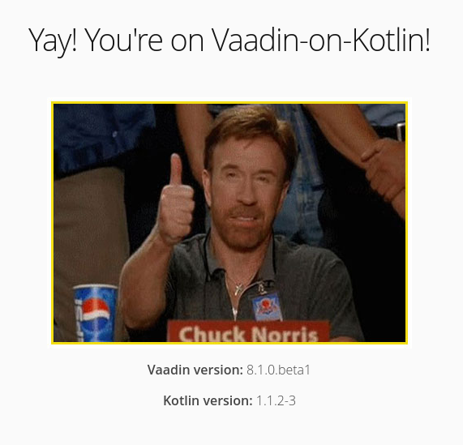
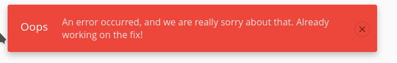
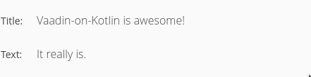
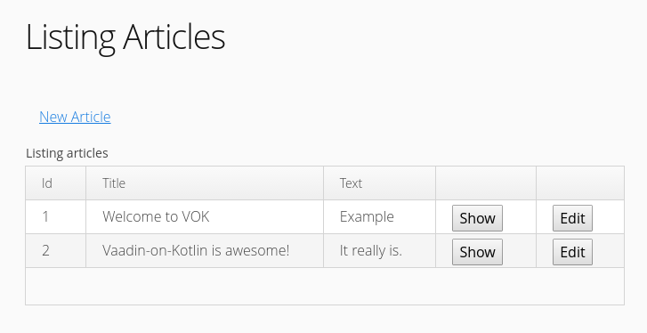
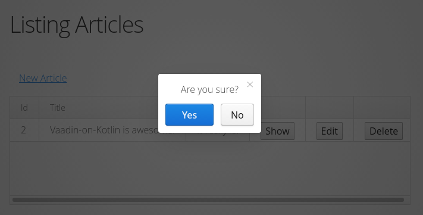

[Index](index.html) | [Getting Started](gettingstarted.html) | [Guides](vok-guides.html)

# Getting started with Vaadin-on-Kotlin Vaadin 8

VoK is an opinionated web application framework which uses Vaadin for its front-end
and Kotlin for its back-end. While Vaadin lets you forget the web and program user interfaces
and let's you program much like when creating a desktop application
with conventional Java toolkits such as AWT, Swing, or SWT, Kotlin allows you to
write clean understandable and save code.

This guide teaches you how to get Vaadin On Kotlin (VoK) up and running. It introduces
the basic concepts needed to create your own applications.

> **Tribute:** I got heavily inspired by the excellent 
> [Ruby on Rails tutorial](http://guides.rubyonrails.org/getting_started.html).

After reading this guide, you will be able to:

* Create a VoK application, and connect it to a database.
* Understand the general layout of a VoK application.
* Write the starting pieces of a VoK application.

> **Note:** To skip the introduction and dive straight into the code, go to [Chapter 3.2](#3_2)

## Guide Assumptions

I assume you have no prior knowledge of VoK and your goal is to create a VoK application from scratch.
Though you don't need to be a seasoned programmer to follow through,
I assume a basic working knowledge of Kotlin and Vaadin.

If you have no prior experience with Kotlin or Vaadin, you might get overwhelmed
by the sheer amount of new information. Therefore, I recommend to take it slowly
and get familiar with both Vaadin and Kotlin first:

* To learn about Kotlin, consider the following materials:
  * [Official Kotlin Programming Language website](https://kotlinlang.org/)
  * [Kotlin Koans](https://kotlinlang.org/docs/tutorials/koans.html)
* If you have no prior experience with Vaadin, take a look at the official documentation:
  * [Official Vaadin website](https://www.vaadin.com)
  * [Vaadin 8 Documentation](https://vaadin.com/docs/v8)

I encourage you to experiment with the [Karibu-DSL Hello World Example](https://github.com/mvysny/karibu-helloworld-application)
at any point since VoK uses Karibu-DSL under the hood; therefore the lessons learned
in the Karibu-DSL Hello World example will come in handy later on in all VoK-based apps.

## What is Vaadin-on-Kotlin?

VoK is glue between Vaadin, Kotlin and other frameworks which allows you to write web apps smoothly.
It is opinionated: it "assumes" there is a best way of doing things, and sometimes
discourages you from doing thing in another way. It assumes also what you needs
to get started so you don't have to develop common features: you write less code
and at the same time, achieve much more than many other languages and frameworks.

The VoK philosophy includes three major guiding principles:

* Simplicity &emdash; things are kept as simple as possible, and libraries are used only when absolutely necessary. Complex patterns such as Dependency Injection
  and MVC are deliberately left out.
* Components as basic building blocks &emdash; Vaadin is a single-page web component framework as opposed to
  the traditional multi-page frameworks. As such, it resembles the traditional fat client
  Swing/JavaFX programming and is closer to GUI software development than the traditional web development with HTML and JavaScript.
  VoK promotes code/UI reuse of components (your components will range from basic ones
  to a complex containers, even forms) instead of creating page templates. It is a predecessor to the Web Components technology.
* No magic &emdash; No proxies, interceptors, reflection. VoK introduces explicit functions.

### Notes For Java Programmers

Traditionally both JavaEE and Spring acted as "glue" which held various frameworks together.
But, with the advent of the Kotlin programming language,
we believe that the features of the Kotlin programming language alone are all that's necessary in the modern programming.
We believe that the era of Dependency Injection, Annotations and auto-discovery magic is over and
Kotlin is all you need to glue stuff together.

While the Dependency Injection (DI) itself is not hard to understand, it comes with unfortunate consequences:
* The DI forces the programmer to create Services/DAOs even for tiny CRUD operations. While having Services may be a desirable
practice in larger project, it is overkill for simple projects.
* The DI requires you to run on a DI container, such as a JavaEE server, or tons of Spring libraries. While that's nothing
  new for a seasoned Java developer, this is overwhelming for a newbie which is just starting with the web app development.
* It quickly tends to get very complex as the DI configuration grows.

Therefore, VoK itself is not using DI; you can of course use Spring or JavaEE in your project alongside VoK if necessary.

> **Note on MVC**: The [Model-View-Controller](https://en.wikipedia.org/wiki/Model%E2%80%93view%E2%80%93controller) pattern
is very popular with page-oriented frameworks such as Ruby on Rails, Groovy on Grails and Python Django. There is typically
lot of things going on in the page, and the MVC pattern helps keeping the code separated into smaller,
more easily digestable packages. 
>
> However, since Components are a much smaller unit of reuse than pages, employing MVC with Component-oriented frameworks
does not make that much sense: for example it will usually leave you with nearly empty Views. We thus believe that using MVC does 
more harm than good since it adds unnecessary complexity. Therefore this tutorial will not use MVC.

## Creating a VoK Project

This guide now instructs you to create a VoK project called blog, a very simple weblog.
The example application has Gradle bundled in;
Gradle will download everything else (Vaadin, Kotlin, libraries, the Jetty server which is used to run the app from the command line).
This makes VoK applications work flawlessly on any OS and CPU which supports Java 8 - be it Windows, Linux or Mac, on x86, ARM or others.

The example application also uses an embedded Java database called [H2](http://www.h2database.com/html/main.html), so
you don't have to set up any database.

We suggest to follow the instructions step by step since all steps are essential
to run this example application and to understand the most important concepts.

### Prerequisites

* Make sure you have Java 8 JDK installed.
* Install IDEA Community Edition: while it is possible to edit the project files
  using any text editor, we recommend to install Intellij IDEA which provides awesome
  Kotlin support including auto-completion. You can use IDEA Community edition, which is free and allows you to run
  gradle tasks to run the app, or you can purchase the Ultimate edition which supports also
  debugging/hot-redeployment of the web app on Tomcat and other
  servers, and offers awesome database integration tools.

### Creating the Blog Application<a name="3_2"></a>

To get the example application, clone it if you have Git installed:
open a command line and run the following command:

```bash
$ git clone https://github.com/mvysny/vok-helloworld-app
```
If you don't have Git, download the application as a [zip file](https://github.com/mvysny/vok-helloworld-app/archive/master.zip).

Once you have the blog application cloned or extracted, switch to its folder and
build it with Gradle:

```bash
$ cd vok-helloworld-app
$ ./gradlew #runs gradle build script
```

The `gradlew` script will run Gradle, which will download the dependencies and compile the application's WAR file.

> **Note:** WAR (Web ARchive) is Java standard for packaging of web applications: the files
> can be deployed to all Java Servlet Servers, including Tomcat, JBoss etc.

The `vok-helloworld-app` directory has a number of files and folders that make up the
structure of a VoK application. Here's a basic rundown of the files and
folders:

| File/Folder       | Content |
|-------------------|-----------------------------------------|
| `web/src/main/kotlin` | source files of Views, Servlets, REST endpoints, async jobs |
| `web/src/main/webapp` | Vaadin theme (a SCSS-based theme which gets compiled to CSS), JavaScript files, additional CSS files and images |
| `web/src/main/resources` | logger configuration file `logback.xml` |
| `build.gradle`    | Gradle tasks that can be run from the command line |
| `README.md`       | brief instruction manual for your application |
| .gitignore        | list of untracked files and folders |

 Most of the work in this tutorial will happen in the
`web/src/main/kotlin` folder.

## Starting up the Web Server

You now have a functional VoK application. To see it, run the web server on your development machine.
From the `vok-helloworld-app` directory, run the following command:

```bash
$ ./gradlew clean web:appRun
```

This will fire up Jetty, an embeddable Java web server. Now open a browser and navigate
 to [http://localhost:8080](http://localhost:8080). You should see the Vaadin-on-Kotlin default information page:



To stop the web server, hit Ctrl+C in the terminal window in which you started the server. 

<!--this is misplaced, should be where you talk about style changes: 
> **Note:** changes in theme files will only be propagated when you are running `./gradlew clean web:appRun` and there is no 
`styles.css` file. If there is, your changes will be ignored until you compile the theme again, by running
`./gradlew vaadinThemeCompile`. Just delete the `styles.css` file, to apply changes to your styles immediately as you edit them.
>
 -->
 
The "Welcome aboard" page signalizes that you have configured your software 
correctly enough for it to serve a page.

## Saying "Hello!"

To make VoK say "Hello", you need to create a View, which is basically one part of a page
with the variable content (as opposed to the page frame, which holds the menu, headers, etc.):
A View's purpose is to provide a Vaadin Component, with which the user interacts.

The View is served to the browser, when it requests a particular route. The route is defined by the
Navigator and that with exactly one route for each View.

As far as the data of the View is concerned, either you collect the data
right in the View itself, which is convenient for small applications,
or you can define a Service layer, which is responsible for data fetching.
The layer comprises a group of regular Kotlin classes which define a clear API for the data fetching.
VoK however does not enforce this, and we will not use the Service-layer pattern here.

As we explained above, a View holds a Vaadin Component, such as, a Layout Component.
All Vaadin Components have three parts:

* the JavaScript-based *client side* which you usually do not use directly;
* the *server side* which you access from your code, and
* the *Connector* which connects the server side and the client side; also not accessed directly by your code

For example, a Button client-side `VButton` defines when to send the notification
that the button was clicked, while the server-side `Button` registers listeners which listen for button clicks.
Client-side `VGrid` shows a list of data in tabular fashion; it performs scrolling and fetching of the data as the user scrolls, via the Connector.
Server-side `Grid` allows you to set the `DataProvider` which actually fetches the data from a data source, such as a database.

To create a new View, create a Kotlin class which implements the `View` interface and extends
a Vaadin Component.
1. Create the `web/src/main/kotlin/com/example/vok/MyWelcomeView.kt` file:
```kotlin
package com.example.vok

import com.github.mvysny.karibudsl.v8.*
import com.vaadin.navigator.View
import com.vaadin.ui.VerticalLayout
import com.vaadin.ui.themes.ValoTheme

@AutoView("")
class MyWelcomeView: VerticalLayout(), View {
    init {
        label("Hello, Vaadin-on-Kotlin!") {
            styleName = ValoTheme.LABEL_H1
        }
    }
}
```
2. Compile the application by running `./gradlew build`.
   Otherwise, the changes in your Kotlin files will not be propagated to the running server.
3. Set the View as the home page so it is displayed when we access the root URL of the site:
[http://localhost:8080](http://localhost:8080):
   1. Open up the `WelcomeView.kt` file and change the `@AutoView("")` annotation to the following:
`@AutoView("old-welcome")`. This will map the original "Welcome aboard" page to
[http://localhost:8080/old-welcome](http://localhost:8080/old-welcome).
   2. In `MyWelcomeView.kt`, note the `@AutoView("")`: this maps requests to the root of the application to the `MyWelcomeView` view.
4. Launch the web server again and navigate to [http://localhost:8080](http://localhost:8080) in your browser. You'll see the "Hello, Vaadin-on-Kotlin!"

## Getting Up and Running

Now that you've seen how to create a view, let's create something with a bit more substance.
We will create a simple Blog application. First, let's create a new database table, or in REST terms, a resource. A resource is the term used 
for a collection of similar objects, such as articles, people or animals.
Later we will implement the create, 
read, update and destroy operations, referred to as CRUD, over the resource items.

VoK provides a resources method which can be used to declare a standard REST resource. But first, let us define the article:
Create the `web/src/main/kotlin/com/example/vok/Article.kt` file with the following contents:

```kotlin
package com.example.vok

import com.github.vokorm.*

data class Article(
        override var id: Long? = null,
        var title: String? = null,
        var text: String? = null
) : Entity<Long> {
    companion object : Dao<Article>
}
```

This is an *entity class*: note the `data` keyword; each
instance represents a row in the "Article" database table.

We can now implement the REST endpoint for REST clients to access the article resource.
> **Note:** This step is completely optional and is actually not used by Vaadin, since
Vaadin connectors use its internal JSON protocol (called UIDL) to communicate with components.
Having REST may come handy though, since we can use it to examine the state of the database
using the `curl` or `wget` tools directly from the command line.

Just create a file `web/src/main/kotlin/com/example/vok/ArticleRest.kt`:

```kotlin
package com.example.vok

import com.github.mvysny.karibudsl.v8.getAll
import com.github.vokorm.*
import io.javalin.Javalin
import io.javalin.NotFoundResponse

fun Javalin.articleRest() {
    get("/rest/articles/:id") { ctx ->
        val id = ctx.pathParam("id").toLong()
        ctx.json(Article.findById(id) ?: throw NotFoundResponse("No article with id $id"))
    }
    get("/rest/articles") { ctx -> ctx.json(Article.findAll()) }
}
```

To put these REST endpoints to use, in the `Bootstrap.kt`, edit the `configureRest()` function at the end of the file and make sure it calls our `articleRest()` function:

```kotlin
fun Javalin.configureRest(): Javalin {
    val gson = GsonBuilder().create()
    gson.configureToJavalin()
    articleRest()
    return this
}
```

Now you can retrieve the articles via a REST call. Just restart the server and give it a go.

```bash
$ curl localhost:8080/rest/articles
```

You will get `Internal server error`; the server log will show a long stacktrace with the most interesting
part being
```
Caused by: org.h2.jdbc.JdbcSQLException: Table "ARTICLE" not found; SQL statement:
select * from Article [42102-196]
	at org.h2.message.DbException.getJdbcSQLException(DbException.java:345)
	at org.h2.message.DbException.get(DbException.java:179)
	at org.h2.message.DbException.get(DbException.java:155)
```

This is because we haven't yet created the table for Articles. We'll do that in a minute.
In the next section, you will add the ability to create articles and view them.
This is the "C" and the "R" from CRUD: create and read. The form for doing this will look like this:


It will look a little basic for now, but that's ok. We'll look at improving the styling for it afterwards.

### The first form

Firstly, you need a place within the application to create an article. A great place for that 
would be at `create-article`. Navigate to [http://localhost:8080/create-article](http://localhost:8080/create-article) and you'll see a general error:



This mean there is no View mapped to the `create-article` route, yet.
Let's create a Kotlin file `web/src/main/kotlin/com/example/vok/CreateArticleView.kt` with the view:

```kotlin
package com.example.vok

import com.github.mvysny.karibudsl.v8.*
import com.vaadin.navigator.*
import com.vaadin.ui.VerticalLayout
import com.vaadin.ui.themes.ValoTheme

@AutoView
class CreateArticleView: VerticalLayout(), View {
    private val binder = beanValidationBinder<Article>()
    init {
        label("New Article") {
            styleName = ValoTheme.LABEL_H1
        }
        textField("Title") {
            bind(binder).bind(Article::title)
        }
        textArea("Text") {
            bind(binder).bind(Article::text)
        }
        button("Save Article") 
    }
}
```
If you restart the server and refresh the page now, you'll see the form from our example above.
The `CreateArticleView` has been mapped automatically to the address `create-article`.
Building forms in VoK is really just that easy!

### Creating articles

However there is a problem with the form: when you click the "Save Article" button, nothing happens
because there is no listener for the click. We need to add the database code to save the article.

To make the "Save Article" button do something, just change the class as follows:
```kotlin
package com.example.vok

import com.github.mvysny.karibudsl.v8.*
import com.vaadin.navigator.*
import com.vaadin.ui.VerticalLayout
import com.vaadin.ui.themes.ValoTheme

@AutoView
class CreateArticleView: VerticalLayout(), View {
    private val binder = beanValidationBinder<Article>()
    init {
        label("New Article") {
            styleName = ValoTheme.LABEL_H1
        }
        textField("Title") {
            bind(binder).bind(Article::title)
        }
        textArea("Text") {
            bind(binder).bind(Article::text)
        }
        button("Save Article") {
            //we added the listener here:
            onLeftClick {
                val article = Article()
                if (binder.writeBeanIfValid(article)) {
                    article.save()
                }
            }
        }
    }
}
```

Now when you click the "Save Article" button, you'll see the good old Oops error - we haven't
created the database table for Article, yet.

As we'll see later, `binder.writeBeanIfValid()` returns a boolean indicating whether the article was saved or not.

### Creating the Article model

Luckily, we have already created the model &emdash; it's the `Article` entity class. We will use [VoK-ORM](https://github.com/mvysny/vok-orm) which will map the Article object to a relational database. By default it will map to the "Article" table.
To create the table, we will have to create the migration.

> **Note:** Sql2o is smart enough to automatically map column names to the Article class properties,
which means you don't have to provide the database name for each entity property, as that is done automatically by Sql2o.

To create the migration, create a file named `V01__CreateArticle.sql` in the `web/src/main/resources/db/migration` directory, with the following contents:

```sql
create table Article(
  id bigint auto_increment PRIMARY KEY,
  title varchar(200) NOT NULL,
  text varchar(4000) NOT NULL
);
```

This is an SQL data definition (DDL) script which creates a table named Article with three columns. We are using the H2 database
SQL dialect here: migrations are simple SQL scripts which create and modify database tables.

The database migration is done automatically,
on the web app startup, by the `Bootstrap` class. You can also reconfigure your app to do the migrations manually instead,
simply by commenting out the relevant part of the `Bootstrap` class and altering the `build.gradle` file as stated in the
[Flyway Gradle documentation](https://flywaydb.org/getstarted/firststeps/gradle).

If you look in the `V01__CreateArticle.sql` file, you'll see the `V01` prefix, followed by two underscores, and then the script name.
The name may be arbitrary while the number defines the execution order -
migration scripts run in the order defined by the version number. Each script runs once. You can read more about the exact numbering
rules in the [Flyway Versioned Migrations Guide](https://flywaydb.org/documentation/migration/versioned).

Simply kill and restart the server, to automatically run all migrations.
Since we are using an in-memory H2 database, its contents is deleted when the server is killed,
and since we are starting with a fresh database, all migration scripts run. When we'll use a persistent database,
Flyway will make sure that only a newly defined migrations are run.

### Saving data in the CreateArticleView

Go again to `http://localhost:8080/create-article` and click the "Save Article" button - seemingly nothing
happens but you have just saved the article in the embedded database.

To allows us to see the saved article,
we will redirect to a new view `ArticleView`.

> **Note:** You might be wondering why the A in Article is capitalized above, whereas most other references to articles in this guide use lowercase.
In this context, we are referring to the class named Article that is defined in `web/src/main/kotlin/com/example/vok/Article.kt`.
Class names in Kotlin must begin with a capital letter.

### Displaying Articles

If you submit the form now, VoK stays on the form. That's not very useful though, so let's add the show action.
We want to navigate to a form with details of the article we have *just created*.
Therefore we need to pass a parameter with the article id to the `ArticleView`.
via the Vaadin Navigator in the form
[http://localhost:8080/article/12](http://localhost:8080/article/12):
Create the `web/src/main/kotlin/com/example/vok/ArticleView.kt` file:
```kotlin
package com.example.vok

import com.github.mvysny.karibudsl.v8.*
import com.github.vokorm.getById
import com.vaadin.navigator.*
import com.vaadin.ui.*

@AutoView
class ArticleView: FormLayout(), View {
    private val title: Label
    private val text: Label
    init {
        title = label {
            caption = "Title:"
        }
        text = label {
            caption = "Text:"
        }
    }
    override fun enter(event: ViewChangeListener.ViewChangeEvent) {
        val articleId = event.parameterList[0]?.toLong() ?: throw RuntimeException("Article ID is missing")
        val article = Article.getById(articleId)
        title.value = article.title
        text.value = article.text
    }

    companion object {
        fun navigateTo(articleId: Long) = navigateToView<ArticleView>(articleId.toString())
    }
}
```
Note that we use `Article.getById(id)` to find the article we're interested in,
passing in `event.parameterList[0]` to get the first parameter from the request. In Vaadin,
parameters are slash-separated and unnamed. The parameter is passed to the `navigateToView<>()` function
which takes the view class and a list of string parameters as its input, constructs the target URL
and redirects the browser to the URL. In this case, [http://localhost:8080/article/12](http://localhost:8080/article/12).

The Navigator then detects that the URL has been changed, it parses the view name out of the URL and
invokes the `view.enter()` method. You can retrieve the parameter list using `event.parameterList` map. 

To navigate to the Article View, just add `ArticleView.navigateTo(article.id!!)` to your `CreateArticleView.kt` file,
right below the `article.save()` call as follows:

```kotlin
...
        button("Save Article") {
            onLeftClick {
                val article = Article()
                if (binder.writeBeanIfValid(article)) {
                    article.save()
                    ArticleView.navigateTo(article.id!!)
                }
            }
        }
...
```

With this change, you should be able to create a new article and have it displayed. Visit
[http://localhost:8080/create-article](http://localhost:8080/create-article) and give it a try!



### Listing all articles

We still need a way to list all our articles, so let's do that. Create the `web/src/main/kotlin/com/examples/vok/ArticlesView.kt`:

```kotlin
package com.example.vok

import eu.vaadinonkotlin.vaadin8.sql2o.dataProvider
import com.github.mvysny.karibudsl.v8.*
import com.vaadin.navigator.*
import com.vaadin.ui.*
import com.vaadin.ui.themes.ValoTheme

@AutoView
class ArticlesView: VerticalLayout(), View {
    private val grid: Grid<Article>
    init {
        setSizeFull()
        label("Listing Articles") {
            styleName = ValoTheme.LABEL_H1
        }
        grid = grid(dataProvider = Article.dataProvider) {
            expandRatio = 1f; setSizeFull()
            addColumnFor(Article::id)
            addColumnFor(Article::title)
            addColumnFor(Article::text)
        }
    }
    override fun enter(event: ViewChangeListener.ViewChangeEvent?) {
        grid.refresh()
    }
}
```

Now if you go to [http://localhost:8080/articles](http://localhost:8080/articles) you will see a list of all the articles that you have created.
Note that we have used the Grid component. Grid is a powerful tabular component which supports paging and lazy-loading of the data,
including sorting and filtering.

### Adding links
You can now create, show, and list articles. Now let's add some links to navigate through pages.

Open `web/src/main/kotlin/com/example/vok/MyWelcomeView.kt` and modify its `init {}` contents as follows:

```kotlin
    init {
        verticalLayout {
            label("Hello, Vaadin-on-Kotlin!") {
                styleName = ValoTheme.LABEL_H1
            }
            button("My Blog") {
                styleName = ValoTheme.BUTTON_LINK
                onLeftClick { navigateToView<ArticlesView>() }
            }
        }
    }
```

The Vaadin `Button` component can also act as a link. It thus creates a hyperlink based on text to display and where to go - in this case, to the path for articles.

Let's add links to the other views as well, starting with the "New Article" link in `ArticlesView`, placing it above the `grid` declaration:

```kotlin
        button("New Article") {
            styleName = ValoTheme.BUTTON_LINK
            onLeftClick { navigateToView<CreateArticleView>() }
        }
```

Now, add another link in `CreateArticleView` underneath the form's "Save Article" button as the last line of the `init{}` block:

```kotlin
        button("Back") {
            styleName = ValoTheme.BUTTON_LINK
            onLeftClick { navigateToView<ArticlesView>() }
        }
```

Finally, add a Back link into the `init{}` block of to `ArticleView` (under the labels) so that users can go back to view the list again:

```kotlin
        button("Back") {
            styleName = ValoTheme.BUTTON_LINK
            onLeftClick { navigateToView<ArticlesView>() }
        }
```

> **Note:** remember, when you are running the server via `./gradlew web:appRun`, you either need to kill the server and re-run it,
or you'll need to run `./gradlew build` in another terminal to actually see the outcome of your changes.

### Adding Validation

The entity file `Article.kt` is about as simple as it can get.

The file is pretty minimalistic &emdash; Sql2o and Vaadin-on-Kotlin supply a great deal of
functionality to your entities for free, including basic CRUD
operations, data validation, as well as
sophisticated search support and the ability to relate multiple models to one another.

But the basic validation does not cut it and it is time to add some validation rules
to validate the data that you send to models.
Edit `Article.kt` as follows:

```kotlin
package com.example.vok

import com.github.vokorm.*
import eu.vaadinonkotlin.vaadin8.sql2o.*
import org.hibernate.validator.constraints.Length
import javax.validation.constraints.NotNull

data class Article(
        override var id: Long? = null,
        //added these annotations:
        @field:NotNull
        @field:Length(min = 5)
        var title: String? = null,

        var text: String? = null
) : Entity<Long> {
    companion object : Dao<Article>
}
```

With these changes all articles must have a title that is at least five characters long.
VoK can validate a variety of conditions in an entity, including the presence or uniqueness
of columns, their format, and the existence of associated objects. The [Hibernate Validator](http://hibernate.org/validator/) is used
to provide validation support; validations are covered
in detail in the Hibernate Validator documentation.

With the validation in place, when you call `binder.writeBeanIfValid(article)` on an invalid
article, it will return `false`. If you open `CreateArticleView.kt`
again, you'll notice that we actually check the result of `binder.writeBeanIfValid(article)`
inside the create action. Now, if `writeBeanIfValid()` fails, the form should remain displayed
and the fields with problems marked as invalid. To do this, change the button definition as follows:

```kotlin
        button("Save Article") {
            onLeftClick { event ->
                val article = Article()
                //adjusted the condition and added else:
                if (binder.validate().isOk && binder.writeBeanIfValid(article)) {
                    article.save()
                    ArticleView.navigateTo(article.id!!)
                } else {
                    event.button.componentError = UserError("There are invalid fields")
                }
            }
        }
```

The `binder.validate().isOk` call marks invalid fields, while `binder.writeBeanIfValid(article)` writes the values to
the `article` entity if the values are valid.

Now reload [http://localhost:8080/create-article](http://localhost:8080/create-article) and try to save an article without a title:
The form will remain displayed with the invalid fields marked red; also the "Save Article" button will be marked red.

### Updating Articles

We've covered the "CR" part of CRUD. Now let's focus on the "U" part &emdash; updating articles.

First, create the edit view class `web/src/main/kotlin/com/example/vok/EditArticleView.kt`:

```kotlin
package com.example.vok

import com.github.mvysny.karibudsl.v8.*
import com.github.vokorm.getById
import com.vaadin.navigator.*
import com.vaadin.server.UserError
import com.vaadin.ui.VerticalLayout
import com.vaadin.ui.themes.ValoTheme

@AutoView
class EditArticleView: VerticalLayout(), View {
    private val binder = beanValidationBinder<Article>()
    private var article: Article? = null
    init {
        label("Edit Article") {
            styleName = ValoTheme.LABEL_H1
        }
        textField("Title") {
            bind(binder).bind(Article::title)
        }
        textArea("Text") {
            bind(binder).bind(Article::text)
        }
        button("Save Article") {
            onLeftClick { event ->
                val article = article!!
                if (binder.validate().isOk && binder.writeBeanIfValid(article)) {
                    article.save()
                    ArticleView.navigateTo(article.id!!)
                } else {
                    event.button.componentError = UserError("There are invalid fields")
                }
            }
        }
        button("Back") {
            styleName = ValoTheme.BUTTON_LINK
            onLeftClick { navigateToView<ArticlesView>() }
        }
    }
    override fun enter(event: ViewChangeListener.ViewChangeEvent) {
        val articleId = event.parameterList[0]!!.toLong()
        edit(Article.getById(articleId))
    }

    private fun edit(article: Article) {
        this.article = article
        binder.readBean(article)
    }

    companion object {
        fun navigateTo(articleId: Long) = navigateToView<EditArticleView>(articleId.toString())
    }
}
```

The view contains a form similar to the one for creating new articles. The only difference is that
when the view is entered, that is, navigated to, it looks up the article ID, loads the article and binds
it with the components.

Now, we need to display a link for the edit action in the list of all the articles.
Let's add that to `ArticlesView.kt` to make it appear along with the "Show" link:

```kotlin
        grid = grid(dataProvider = Article.dataProvider) {
            expandRatio = 1f; setSizeFull()
            addColumnFor(Article::id)
            addColumnFor(Article::title)
            addColumnFor(Article::text)
            //added these columns:
            addColumn({ "Show" }, ButtonRenderer<Article>({ event -> ArticleView.navigateTo(event.item.id!!) }))
            addColumn({ "Edit" }, ButtonRenderer<Article>({ event -> EditArticleView.navigateTo(event.item.id!!) }))
        }
```

> **Note**: The `ButtonRenderer` will be marked red; you will need to import the class. You can do that simply by pressing `Alt+Enter`
and choosing *Import* from the menu.

And we'll also add the link to `ArticleView.kt` as well:

```kotlin
package com.example.vok

import com.github.mvysny.karibudsl.v8.*
import com.github.vokorm.getById
import com.vaadin.navigator.*
import com.vaadin.ui.*
import com.vaadin.ui.themes.ValoTheme

@AutoView
class ArticleView: FormLayout(), View {
    //added article property:
    private lateinit var article: Article
    private val title: Label
    private val text: Label
    init {
        title = label {
            caption = "Title:"
        }
        text = label {
            caption = "Text:"
        //added the edit button:
        button("Edit") {
            styleName = ValoTheme.BUTTON_LINK
            onLeftClick { EditArticleView.navigateTo(article.id!!) }
        }
        button("Back") {
            styleName = ValoTheme.BUTTON_LINK
            onLeftClick { navigateToView<ArticlesView>() }
        }
    }
    override fun enter(event: ViewChangeListener.ViewChangeEvent) {
        val articleId = event.parameterList[0]?.toLong() ?: throw RuntimeException("Article ID is missing")
        //removed local article variable and use the property instead:
        //val article = Article.getById(articleId)
        article = Article.getById(articleId)
        title.value = article.title
        text.value = article.text
    }

    companion object {
        fun navigateTo(articleId: Long) = navigateToView<ArticleView>(articleId.toString())
    }
}
```

And here's the resulting form:



### Creating components to clean up duplication in views

Our `EditArticleView` view looks very similar to the `CreateArticleView` view; in fact,
they both share the same code for displaying the form. 
Let's remove this duplication by using a common component.

Create a new file `web/src/main/kotlin/com/example/vok/ArticleEditor.kt` with the following content:

```kotlin
package com.example.vok

import com.github.mvysny.karibudsl.v8.*
import com.vaadin.server.UserError
import com.vaadin.ui.*
import com.vaadin.ui.themes.ValoTheme

class ArticleEditor : VerticalLayout() {
    private val binder = beanValidationBinder<Article>()
    var article: Article? = null
        set(value) {
            field = value
            if (value != null) binder.readBean(value)
        }

    init {
        isMargin = false
        textField("Title") {
            bind(binder).bind(Article::title)
        }
        textArea("Text") {
            bind(binder).bind(Article::text)
        }
        button("Save Article") {
            onLeftClick { event ->
                val article = article!!
                if (binder.validate().isOk && binder.writeBeanIfValid(article)) {
                    article.save()
                    ArticleView.navigateTo(article.id!!)
                } else {
                    event.button.componentError = UserError("There are invalid fields")
                }
            }
        }
        button("Back") {
            styleName = ValoTheme.BUTTON_LINK
            onLeftClick { navigateToView<ArticlesView>() }
        }
    }
}

fun HasComponents.articleEditor(block: ArticleEditor.()->Unit = {}) = init(ArticleEditor(), block)
```

This is just an ordinary Vaadin component which you can insert anywhere into your View. Its API consists of a single public
property named `article`. `ArticleEditor` populates the fields with the data from the property.
When you press the "Save Article" button, `ArticleEditor` either creates a new article, or updates an existing one.

Noteworthy is the function `HasComponents.articleEditor()`: it that allows us to 
build Vaadin UIs in a structured way using Kotlin code.
This technique is called DSL (Domain Specific Language). The name fits &emdash; we have constructed
a sort of a language to create Vaadin UIs. You can find more information about the DSLs at the [DSLs: Explained](http://www.vaadinonkotlin.eu/dsl_explained.html) article.

With the type-safe builders, the Kotlin compiler will check for typos in DSL and
the Kotlin IDEA plugin will help us with the auto-completion.

> **Note:** The [Karibu-DSL](https://github.com/mvysny/karibu-dsl) library defines builder functions for every Vaadin component.
You can check the [Basic.kt](https://github.com/mvysny/karibu-dsl/blob/master/karibu-dsl-v8/src/main/kotlin/com/github/mvysny/karibudsl/v8/Basic.kt) file
for the definitions of the sources for the `button` and `textField` builder methods.

Rewrite `CreateArticleView.kt` so it uses the new component:

```kotlin
package com.example.vok

import com.github.mvysny.karibudsl.v8.*
import com.vaadin.navigator.*
import com.vaadin.ui.VerticalLayout
import com.vaadin.ui.themes.ValoTheme

@AutoView
class CreateArticleView: VerticalLayout(), View {
    private val editor: ArticleEditor
    init {
        label("New Article") {
            styleName = ValoTheme.LABEL_H1
        }
        editor = articleEditor {
            article = Article()
        }
    }
}
```

Then do the same for the `EditArticleView.kt` view:

```kotlin
package com.example.vok

import com.github.mvysny.karibudsl.v8.*
import com.github.vokorm.getById
import com.vaadin.navigator.*
import com.vaadin.ui.VerticalLayout
import com.vaadin.ui.themes.ValoTheme

@AutoView
class EditArticleView : VerticalLayout(), View {
    private val editor: ArticleEditor
    init {
        label("Edit Article") {
            styleName = ValoTheme.LABEL_H1
        }
        editor = articleEditor()
    }
    override fun enter(event: ViewChangeListener.ViewChangeEvent) {
        val articleId = event.parameterList[0]!!.toLong()
        editor.article = Article.getById(articleId)
    }

    companion object {
        fun navigateTo(articleId: Long) = navigateToView<EditArticleView>(articleId.toString())
    }
}
```

### Deleting Articles

We're now ready to cover the "D" part of CRUD, deleting articles from the database. To delete the article, all that's
needed is to call `delete()` in the article from appropriate place. 

Add the 'Destroy' link to the `ArticlesView.kt` file:

```kotlin
package com.example.vok

import com.github.mvysny.karibudsl.v8.*
import com.vaadin.navigator.*
import com.vaadin.ui.*
import com.vaadin.ui.renderers.ButtonRenderer
import com.vaadin.ui.themes.ValoTheme
import eu.vaadinonkotlin.vaadin8.sql2o.dataProvider

@AutoView
class ArticlesView: VerticalLayout(), View {
    private val grid: Grid<Article>
    init {
        setSizeFull()
        label("Listing Articles") {
            styleName = ValoTheme.LABEL_H1
        }
        button("New Article") {
            styleName = ValoTheme.BUTTON_LINK
            onLeftClick { navigateToView<CreateArticleView>() }
        }
        grid = grid(dataProvider = Article.dataProvider) {
            expandRatio = 1f; setSizeFull()
            addColumnFor(Article::id)
            addColumnFor(Article::title)
            addColumnFor(Article::text)
            addColumn({ "Show" }, ButtonRenderer<Article>({ event -> ArticleView.navigateTo(event.item.id!!) }))
            addColumn({ "Edit" }, ButtonRenderer<Article>({ event -> EditArticleView.navigateTo(event.item.id!!) }))
            addColumn({ "Destroy" }, ButtonRenderer<Article>({ event ->
                confirmDialog {
                    event.item.delete()
                    this@grid.refresh()
                }
            }))
        }
    }
    override fun enter(event: ViewChangeListener.ViewChangeEvent?) {
        grid.refresh()
    }
}
```

The "Destroy" button calls the `confirmDialog` which shows a simple Vaadin dialog. The function is implemented in a way that
it will call the follow-up block when the "Yes" button is clicked. The block will just delete the article
and refresh the Grid, to display the new data. To get rid of the confirmation dialog, just delete the `confirmDialog` line:
```kotlin
            addColumn({ "Destroy" }, ButtonRenderer<Article>({ event ->
                event.item.delete()
                this@grid.refresh()
            }))
```

> **Note:** To see the definition of the function,
open Intellij IDEA and click the `confirmDialog` function name while holding the `ctrl` key.



Congratulations! You can now create, show, list, update and destroy articles.

## Adding a Second Database Entity

It's time to add a second database table to the application. It will handle comments on articles.

### Creating the 'Comments' Entity

We'll create a `Comment` entity which will hold comments for each article.

Create the following file: `web/src/main/kotlin/com/example/vok/Comment.kt` with the following contents:

```kotlin
package com.example.vok

import com.github.vokorm.*
import org.hibernate.validator.constraints.Length
import javax.validation.constraints.NotNull

data class Comment(
        override var id: Long? = null,

        var article_id: Long? = null,

        @field:NotNull
        @field:Length(min = 3)
        var commenter: String? = null,

        @field:NotNull
        @field:Length(min = 3)
        var body: String? = null
) : Entity<Long> {
    companion object : Dao<Comment>

    val article: Article? get() = if (article_id == null) null else Article.findById(article_id!!)
}
```

This is very similar to the `Article` entity. The difference is the property `article`
which sets up an association of the comment to an article.
Note the `article_id` column - it tells which Article the comment belongs to.
You'll learn more about associations between entities in the next section of this guide.

Let's create the migration script for the comment: create
`web/src/main/resources/db/migration/V02__CreateComment.sql` file:

```sql
create TABLE Comment(
  id bigint auto_increment PRIMARY KEY,
  commenter varchar(200) NOT NULL,
  body VARCHAR(4000) NOT NULL,
  article_id bigint not null REFERENCES Article(id)
);
```

The `article_id` line creates an integer column called `article_id`, an index for it, and a
foreign key constraint that points to the `id` column of the articles table. Go ahead and run
the project.

Since we are running an embedded database which starts in a clear state, all migration scripts will run:
 
```
15:43:44.532 [RMI TCP Connection(2)-127.0.0.1] INFO  com.example.vok.Bootstrap - Running DB migrations
15:43:44.553 [RMI TCP Connection(2)-127.0.0.1] INFO  o.f.c.internal.util.VersionPrinter - Flyway 4.2.0 by Boxfuse
15:43:44.676 [RMI TCP Connection(2)-127.0.0.1] INFO  o.f.c.i.dbsupport.DbSupportFactory - Database: jdbc:h2:mem:test (H2 1.4)
15:43:44.754 [RMI TCP Connection(2)-127.0.0.1] INFO  o.f.core.internal.command.DbValidate - Successfully validated 2 migrations (execution time 00:00.026s)
15:43:44.767 [RMI TCP Connection(2)-127.0.0.1] INFO  o.f.c.i.m.MetaDataTableImpl - Creating Metadata table: "PUBLIC"."schema_version"
15:43:44.792 [RMI TCP Connection(2)-127.0.0.1] INFO  o.f.core.internal.command.DbMigrate - Current version of schema "PUBLIC": << Empty Schema >>
15:43:44.794 [RMI TCP Connection(2)-127.0.0.1] INFO  o.f.core.internal.command.DbMigrate - Migrating schema "PUBLIC" to version 01 - CreateArticle
15:43:44.813 [RMI TCP Connection(2)-127.0.0.1] INFO  o.f.core.internal.command.DbMigrate - Migrating schema "PUBLIC" to version 02 - CreateComment
15:43:44.823 [RMI TCP Connection(2)-127.0.0.1] INFO  o.f.core.internal.command.DbMigrate - Successfully applied 2 migrations to schema "PUBLIC" (execution time 00:00.057s).
```

However, if we were to use a persistent database, FlyWay would be smart enough to only execute the migrations that have not been run against the current database, yet.

### Associating Models

Vaadin on Kotlin associations serve to declare the relationship between two entities. In the case of
comments and articles, you could write out the relationships as follows:

* Each comment belongs to one article.
* One article can have many comments.

The first direction of the relationship is already implemented in the `Comment` entity in `Comment.kt`.
Each comment belong to an `Article`:

```kotlin
    val article: Article? get() = if (article_id == null) null else Article.findById(article_id!!)
```

Edit `Article.kt` to add the other side of the association:

```kotlin
package com.example.vok

import com.github.vokorm.*
import eu.vaadinonkotlin.vaadin8.*
import eu.vaadinonkotlin.vaadin8.sql2o.*
import org.hibernate.validator.constraints.Length
import javax.validation.constraints.NotNull

data class Article(
        override var id: Long? = null,

        @field:NotNull
        @field:Length(min = 5)
        var title: String? = null,

        var text: String? = null
) : Entity<Long> {
    companion object : Dao<Article>

    val comments: VokDataProvider<Comment> get() = Comment.dataProvider.withFilter { Comment::article_id eq id }
}
```

The `val comments declaration` enables a good bit of automatic behavior. For example, if you have a
variable `article` containing an article, you can retrieve all the comments belonging to that article
as an array using `article.comments.getAll()`.

Note that the `comments` field is outside of the `data class` constructor. This is intentional
since the `comments` field is not really a field but a computed property and thus cannot stand as a constructor parameter. `comments` is hence lazy &emdash;
it is evaluated every time it is read; when it is read, a database `select` is run.
This is to prevent the `comments` property from appearing in `Article.toString()`
return value so that logging a newly created article, which does call `toString()`, won't run the select.
Computed properties also do not appear in the JSON output as returned by the REST services.
This way we can keep comments from polluting the REST JSON article output.

### Writing the Comment View

Like with any blog, we will create the comment section below the article.
Once our readers have added their comment, they will be sent
back to the article show page with their comment now listed.

First, we'll wire up the `ArticleView.kt` view to let us make a new comment:

```kotlin
package com.example.vok

import com.github.mvysny.karibudsl.v8.*
import com.github.vokorm.getById
import com.vaadin.navigator.*
import com.vaadin.server.UserError
import com.vaadin.ui.*
import com.vaadin.ui.themes.ValoTheme

@AutoView
class ArticleView: FormLayout(), View {
    private lateinit var article: Article
    private val title: Label
    private val text: Label
    private val comments: Label
    private val commentBinder = beanValidationBinder<Comment>()
    private lateinit var createComment: Button
    init {
        title = label {
            caption = "Title:"
        }
        text = label {
            caption = "Text:"
        }
        comments = label { caption = "Comments" }
        formLayout {
            caption = "Add a comment:"
            textField("Commenter:") {
                bind(commentBinder).bind(Comment::commenter)
            }
            textField("Body:") {
                bind(commentBinder).bind(Comment::body)
            }
            createComment = button("Create") {
                onLeftClick { createComment() }
            }
        }
        button("Edit") {
            styleName = ValoTheme.BUTTON_LINK
            onLeftClick { EditArticleView.navigateTo(article.id!!) }
        }
        button("Back") {
            styleName = ValoTheme.BUTTON_LINK
            onLeftClick { navigateToView<ArticlesView>() }
        }
    }
    override fun enter(event: ViewChangeListener.ViewChangeEvent) {
        val articleId = event.parameterList[0]?.toLong() ?: throw RuntimeException("Article ID is missing")
        article = Article.getById(articleId)
        title.value = article.title
        text.value = article.text
    }
    private fun createComment() {
        val comment = Comment()
        if (!commentBinder.validate().isOk || !commentBinder.writeBeanIfValid(comment)) {
            createComment.componentError = UserError("There are invalid fields")
        } else {
            createComment.componentError = null
            comment.article_id = article.id
            comment.save()
            refreshComments()
            commentBinder.readBean(Comment())  // this clears the comment fields
        }
    }
    private fun refreshComments() {
        comments.html(
            // force-update the comments list.
            article.comments.getAll().joinToString("") { comment ->
                "<p><strong>Commenter:</strong>${comment.commenter}</p><p><strong>Comment:</strong>${comment.body}</p>"
            }
        )
    }
    companion object {
        fun navigateTo(articleId: Long) = navigateToView<ArticleView>(articleId.toString())
    }
}
```

This adds a form on the `Article` page that creates a new comment by calling the `comment.save()` code.

Once we have made the new comment, we need to stay on the page of the original article. That's why there is no
`navigate` call in the `createComment()` function. However, since the page does not reload (remember we use the single-page-framework),
we need to refresh the comments ourselves. See the `comments` label? We will populate this label with an HTML-formatted list of all comments.
This is taken care of by the `refreshComments()` function.

Now you can add articles and comments to your blog articles.


> **Note:** The `refreshComments()` the `getAll()` functions re-fetch the fresh list of `comments`; the comments are not cached
in the `Article.comments` field. If you need to access the comment list multiple times, store the list of comments
in a variable.

### Exposing Comments via REST

You can expose the comments via the REST interface. This is completely optional and is not used by Vaadin in any way.
However, it may be very handy to check your database status, for example, using the `curl` tool.

To add the REST support, edit `ArticleRest.kt`:

```kotlin
package com.example.vok

import com.github.mvysny.karibudsl.v8.getAll
import com.github.vokorm.*
import io.javalin.Javalin
import io.javalin.NotFoundResponse

fun Javalin.articleRest() {
    get("/rest/articles/:id") { ctx ->
        val id = ctx.pathParam("id").toLong()
        ctx.json(Article.findById(id) ?: throw NotFoundResponse("No article with id $id"))
    }
    get("/rest/articles") { ctx -> ctx.json(Article.findAll()) }
    get("/rest/articles/:id/comments") { ctx ->
        val id = ctx.pathParam("id").toLong()
        val article = Article.findById(id) ?: throw NotFoundResponse("No article with id $id")
        ctx.json(article.comments.getAll())
    }
}
```

Now, you can run curl in your terminal:
```bash
$ curl localhost:8080/rest/articles/1/comments
[{"id":1,"commenter":"A buddy programmer","body":"I like Vaadin-on-Kotlin, too!"}]
```

## Refactoring

Let's take a better look at the `web/src/main/kotlin/com/example/vok/ArticleView.kt` view:
it is rather long and awkward: we split it in reusable components to clean it up.

### The Comments Component

First, we will extract a component which will display comments for the article. Since we will need to add a 'delete' link
in the future, the `Label` component will no longer suffice.

Create the `web/src/main/kotlin/com/example/vok/CommentsComponent.kt` file:
```kotlin
package com.example.vok

import com.github.mvysny.karibudsl.v8.*
import com.github.vokorm.getById
import com.vaadin.ui.*

class CommentsComponent : VerticalLayout() {
    var articleId: Long = 0L
        set(value) { field = value; refresh() }
    init {
        caption = "Comments"; isMargin = false
    }

    fun refresh() {
        removeAllComponents()
        Article.getById(articleId).comments.getAll().forEach { comment ->
            label {
                html("<p><strong>Commenter:</strong>${comment.commenter}</p><p><strong>Comment:</strong>${comment.body}</p>")
            }
        }
    }
}
// the extension function which will allow us to use CommentsComponent inside a DSL
fun HasComponents.commentsComponent(block: CommentsComponent.()->Unit = {}) = init(CommentsComponent(), block)
```

The component has a handy property `articleId` which, upon setting, will populate itself with comments
for that particular article.

We also need the means to include the `CommentsComponent` component into the DSL, and thus we have also introduced
the DSL extension method as well. The extension function simply calls the `init()` function, which performs the following things:
* Inserts the newly created component (in this case, the `CommentsComponent`) into the parent layout;
* Calls `block` to optionally allow us to configure the component further.
                                  
You can learn more about how DSL works, from the [Writing Vaadin Apps In Kotlin Part 4](http://mavi.logdown.com/posts/1493730) tutorial.

### Converting the Comments Form to a component

Let us also move that new comment section out to its own component. Create the file named
`web/src/main/kotlin/com/example/vok/NewCommentForm.kt` with the following contents:

```kotlin
package com.example.vok

import com.github.mvysny.karibudsl.v8.*
import com.vaadin.server.UserError
import com.vaadin.ui.*

class NewCommentForm : FormLayout() {
    var commentCreatedListener: ()->Unit = {}
    lateinit var article: Article
    private val commentBinder = beanValidationBinder<Comment>()
    private val createComment: Button
    init {
        caption = "Add a comment:"
        textField("Commenter:") {
            bind(commentBinder).bind(Comment::commenter)
        }
        textField("Body:") {
            bind(commentBinder).bind(Comment::body)
        }
        createComment = button("Create") {
            onLeftClick { createComment() }
        }
    }

    private fun createComment() {
        val comment = Comment()
        if (!commentBinder.validate().isOk || !commentBinder.writeBeanIfValid(comment)) {
            createComment.componentError = UserError("There are invalid fields")
        } else {
            createComment.componentError = null
            comment.article_id = article.id
            comment.save()
            commentBinder.readBean(Comment())  // this clears the comment fields
            commentCreatedListener()
        }
    }
}
fun HasComponents.newCommentForm(block: NewCommentForm.()->Unit = {}) = init(NewCommentForm(), block)
```

The component handles the comment creation now. In order for the component to work properly, the article for which the comment is to be created must be set.
Also, when the component creates the comment, it needs to notify the `ArticleView` about this fact. This is done by the means of the
`commentCreatedListener` listener which the component calls upon comment creation. Now, let's refactor the `ArticleView.kt`
to make use of the `NewCommentForm` component, and register itself to `NewCommentForm` as a listener:

```kotlin
package com.example.vok

import com.github.mvysny.karibudsl.v8.*
import com.github.vokorm.getById
import com.vaadin.navigator.*
import com.vaadin.ui.*
import com.vaadin.ui.themes.ValoTheme

@AutoView
class ArticleView: VerticalLayout(), View {
    private lateinit var article: Article
    private lateinit var title: Label
    private lateinit var text: Label
    private val comments: CommentsComponent
    private val newComment: NewCommentForm
    init {
        formLayout {
            title = label {
                caption = "Title:"
            }
            text = label {
                caption = "Text:"
            }
        }
        comments = commentsComponent()
        newComment = newCommentForm {
            commentCreatedListener = { comments.refresh() }
        }
        button("Edit") {
            styleName = ValoTheme.BUTTON_LINK
            onLeftClick { EditArticleView.navigateTo(article.id!!) }
        }
        button("Back") {
            styleName = ValoTheme.BUTTON_LINK
            onLeftClick { navigateToView<ArticlesView>() }
        }
    }
    override fun enter(event: ViewChangeListener.ViewChangeEvent) {
        val articleId = event.parameterList[0]?.toLong() ?: throw RuntimeException("Article ID is missing")
        article = Article.getById(articleId)
        title.value = article.title
        text.value = article.text
        comments.articleId = article.id!!
        newComment.article = article
    }

    companion object {
        fun navigateTo(articleId: Long) = navigateToView<ArticleView>(articleId.toString())
    }
}
```

## Deleting Comments

Another important feature of a blog is being able to delete spam comments. To do this, we need to implement a link of some sort in the `CommentsComponent`.

Let's add a link button to the `CommentsComponent.kt` file:

```kotlin
package com.example.vok

import com.github.mvysny.karibudsl.v8.*
import com.github.vokorm.getById
import com.vaadin.ui.*
import com.vaadin.ui.themes.ValoTheme

class CommentsComponent : VerticalLayout() {
    var articleId: Long = 0L
        set(value) { field = value; refresh() }
    init {
        caption = "Comments"; isMargin = false
    }

    fun refresh() {
        removeAllComponents()
        Article.getById(articleId).comments.getAll().forEach { comment ->
            label {
                html("<p><strong>Commenter:</strong>${comment.commenter}</p><p><strong>Comment:</strong>${comment.body}</p>")
            }
            button("Delete comment") {
                styleName = ValoTheme.BUTTON_LINK
                onLeftClick { comment.delete(); refresh() }
            }
        }
    }
}
// the extension function which will allow us to use CommentsComponent inside a DSL
fun HasComponents.commentsComponent(block: CommentsComponent.()->Unit = {}) = init(CommentsComponent(), block)
```

Clicking the "Delete comment" button will delete the comment and refresh the component, to show the rest of the comments.

### Deleting Associated Objects

If you delete an article, its associated comments will also need to be deleted, otherwise they would simply occupy space in the database. 
Or even worse, since we have the foreign constraint set up, the database would fail to delete the article. We will need to modify the
`Article.delete()` method to do that for us.
Modify the `Article.kt` file and add the `delete` function right below the `comments` val, as follows:

```kotlin
    override fun delete() = db {
        Comment.deleteBy { Comment::article_id eq id }
        super.delete()
    }
```

## Security

If you were to publish your blog online, anyone would be able to add, edit and delete articles or delete comments.

### 9.1 The Login Dialog

Adding security to Java WAR apps is usually done by letting the web server (e.g. Tomcat) handle the username/password storage
and verification, while our web app provides the login dialog. To keep this guide web server agnostic,
we'll do the verification ourselves.

We will implement a login service and a login form. Just create the `web/src/main/kotlin/com/example/vok/LoginService.kt` file:

```kotlin
package com.example.vok

import com.github.mvysny.karibudsl.v8.*
import com.vaadin.server.*
import com.vaadin.ui.*
import eu.vaadinonkotlin.vaadin8.Session
import eu.vaadinonkotlin.vaadin8.loginForm
import java.io.Serializable

data class User(val name: String) : Serializable

class LoginService : Serializable {
    fun login(username: String, password: String): Boolean {
        currentUser = User(username)
        Page.getCurrent().reload()
        return true
    }
    var currentUser: User? = null
    private set

    fun logout() {
        VaadinSession.getCurrent().close()
        Page.getCurrent().reload()
    }

    val isLoggedIn get() = currentUser != null
}

val Session.loginService: LoginService get() = getOrPut { LoginService() }

class LoginView : VerticalLayout() {
    init {
        setSizeFull()
        loginForm("Vaadin-on-Kotlin Sample App") {
            alignment = Alignment.MIDDLE_CENTER
            onLogin { username, password ->
                if (!Session.loginService.login(username, password)) {
                    usernameField.componentError = UserError("The user does not exist or invalid password")
                }
            }
        }
    }
}
```

The code is a bit longer, but the result is worth it. This is how the `LoginView` component looks like:


The `LoginService` class handles the process of login/logout. Upon login,
we will store the information about the currently logged-in
user into the session. This will serve as a marker that there is someone
logged in. We will also tell the browser to reload the page - this
will reinstantiate the `MyUI`. We will now configure `MyUI` to show a
login form if there's nobody logged in yet. Just
edit `MyUI.kt` and change the `init()` method as follows:

```kotlin
    override fun init(request: VaadinRequest?) {
        if (!Session.loginService.isLoggedIn) {
            setContent(LoginView())
            return
        }
        setContent(content)
        navigator = Navigator(this, content as ViewDisplay)
        navigator.addProvider(autoViewProvider)
        ...  // etc, the rest of the init() method
    }

```

### Other Security Considerations

Security, especially in web applications, is a broad and detailed area. You can decide not to use the login dialog at all,
and instead use the HTTP Basic Auth, thus letting the web server handle the security completely. You can also employ
other security options. This is however out of scope of this tutorial.

Please see the [Vaadin-on-Kotlin Security Demo](https://github.com/mvysny/vok-security-demo) sample project for more details.

## What's Next?

Now that you've seen your first VoK application, you should feel free to update it and experiment on your own.

Remember you don't have to do everything without help. As you need assistance getting up and running with VoK, feel free to consult these support resources:

* The [Vaadin-on-Kotlin Guides](vok-guides.md)
* The [Vaadin Tutorial](https://vaadin.com/docs/-/part/framework/introduction/intro-walkthrough.html) for documentation on pure Vaadin and Java
* The [Vaadin Forums](https://vaadin.com/forum) for anything Vaadin-on-Kotlin-related
* The [Kotlin Forums](https://discuss.kotlinlang.org/) for Kotlin-related questions

## Feedback

You're encouraged to help improve the quality of this guide.

Please contribute if you see any typos or factual errors. To get started, you can read our 
[documentation contributions](contributing.html) section.

You may also find incomplete content, or stuff that is not up to date. Please do add any missing documentation for master.
Check the [Vaadin On Kotlin Guides Guidelines](todo) for style and conventions.

If for whatever reason you spot something to fix but cannot patch it yourself, please [open an issue](https://github.com/mvysny/vaadin-on-kotlin/issues).

And last but not least, any kind of discussion regarding Vaadin on Kotlin documentation is very welcome in the [Vaadin Forums](https://vaadin.com/forum).

<sub><sup>This work is licensed under a [Creative Commons Attribution-ShareAlike 4.0 International License](https://creativecommons.org/licenses/by-sa/4.0/)</sup></sub>
